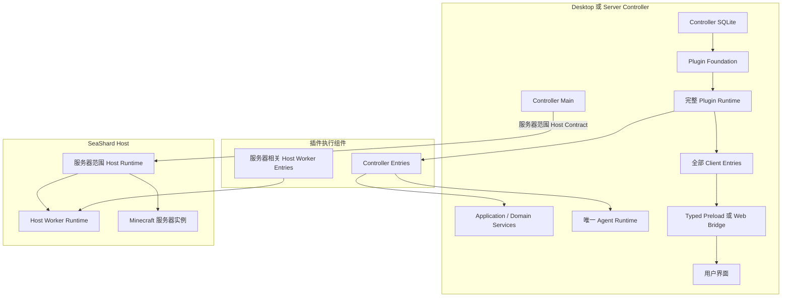

# SeaShard 总体设计

> 状态：当前总体设计基线
>
> 更新时间：2026-08-23
>
> 范围：产品定位、组件与插件模型、Host/Client 边界、公开 Contract、当前能力和近期建设顺序

## 1. 项目定位

SeaShard 是一个以插件系统为核心、原生支持智能助手的 Minecraft 启动器、整合包管理器和服务器管理工具。

产品能力采用组件化组织：长期运行、具有生命周期、可以启停或被其他能力依赖的功能，均由组件提供。DTO、Schema、Manifest、纯函数和普通数据实体保持为静态代码，不为组件化增加无效包装。

插件系统从产品第一天起就是核心能力：

- 内置功能、官方扩展和第三方扩展遵循同一种 Package、Entry、Contract 与生命周期模型；
- 插件安装到 SeaShard 应用本身，不按某个服务器、工作区或会话重复安装；
- 插件可以操作多个服务器或其他领域对象，目标 ID 通过 Contract 参数和事件载荷传递；
- 插件可以发布自己的 Contract，供其他插件继续组合；
- SeaShard 应用插件与 Minecraft Mod、服务端插件、资源包和数据包始终分开管理。

当前优先交付 Electron Desktop。Web UI、Mobile Client 和 Headless Host 保留为正式长期方向，但不提前建设缺少真实纵切的抽象层。

### 1.1 当前非目标

- 不为 Renderer 复制完整的 Cordis 业务运行时；
- 不开放万能 IPC、万能 Service 或任意字符串 RPC；
- 不在安装插件时运行 npm、pnpm、yarn、bun 或构建脚本；
- 不要求第三方插件使用 Wasm；
- 不把尚未开始实施的商业云、移动端和调度系统写成当前能力；
- 不为未出现的兼容需求建立迁移层和旧格式适配。

## 2. 总体架构



Controller 与 Host 遵循不可互换的职责边界：

1. 每个 Desktop Controller 或 Server Controller 都独立启动 Controller SQLite、Plugin Foundation、完整 Plugin Runtime、全部 Client Entry 和唯一 Agent Runtime；
2. 插件安装、插件市场、应用设置、用户界面、领域逻辑、跨 Host 聚合以及 Agent 会话、模型、凭据、Tool、Resource 和 Provider 全部归 Controller；
3. Host 是服务器实例的受控执行外壳，只把本机或远程 Minecraft 服务器实例及其必要机器能力挂载给 Controller；
4. Host 只运行服务器管理所需的最小 Runtime，以及必须贴近服务器实例执行的 Host Worker；通用插件后端、应用页面和 Agent Runtime 不进入 Host；
5. Agent Tool 由 Controller Entry 或 Controller Worker 注册，实例能力只接收 `instanceId`；Controller 返回的 ID 始终包含 Host 身份，调用时也允许使用省略 Host 的实例 ID 简写，连接变化只改变相关服务器能力的可用状态，不改变 Agent Runtime；
6. Controller 退出时，交互式 Agent 随之停止。需要常驻 Agent 时必须持续运行 Server Controller，不能把 Agent 生命周期转移给 Host；
7. Host 可以在 Controller 断开后继续维持已经运行的服务器进程、容器、服务器范围持久任务和 Host Worker，但不能继续模型循环或用户交互；
8. Host 启动或连接失败只影响对应服务器实例，不能阻止 Controller、插件市场、Agent 和其他应用功能启动。

当前普通插件运行时保持简单：

- Cordis Fiber 拥有组件生命周期和副作用清理；
- Plugin Kernel 保存 Package、当前版本、Binding 和运行快照；
- Entry 变化时先停止旧 Fiber，再启动新 Fiber；
- 不维护候选代次、双实例发布、调用租约或热切换状态机；
- 启动失败记录为当前 Runtime 的失败状态；版本选择失败时恢复之前选中的 Package。

### 2.1 Controller 与 Host 连接体验

- 单个 Controller 正常控制单个本机 Host 时，不显示顶部 Host 指示器和右侧 Host 栏；
- 出现连接失败、只读占用、控制权请求或多个 Host 时，顶部显示 Host 状态入口，右侧栏承载当前连接概览与快捷操作；
- Host 连接、Agent、插件目录、插件设置、关于、个性化以及服务器管理页面均由 Controller Client Entry 提供；
- Host 断开时，服务器页面保留并将对应实例事实标记为未知，依赖连接的操作不可用；其他应用页面和 Agent 会话不受影响；
- 同一 Host 同时只接受一个 Controller 的变更请求；其他已连接 Controller 保持只读观察；
- 后连接的 Controller 可以发起接管请求。请求端确认接管，或当前控制端允许交出后，Host 原子切换控制权并拒绝旧控制端后续写入；
- Host 占用、接管和连接失败全部在 SeaShard 内容区域内处理，不调用操作系统原生弹窗；
- 本机连接和后续 SSH 连接共享同一数组快照、状态模型与界面，不为远程 Host 建立第二套交互。

### 2.2 实例寻址

- Host 只生成和理解自身范围内的 `hostLocalInstanceId`；
- Controller 挂载实例时，将 Host 身份与 Host 内实例 ID 组合成规范 `instanceId`，形式可以是经过统一编码的 `hostId:hostLocalInstanceId`；
- Client Entry、内部组件、普通插件和 Agent Tool 获取到的始终是规范完整 ID，并将其作为不透明标识原样保存和传递；
- 实例 Service、实例事件和实例相关能力只使用一个 `instanceId` 参数，不附加独立的 `hostId` 参数；
- 调用实例能力时既可传规范完整 ID，也可只传 `hostLocalInstanceId` 简写。Controller 对完整 ID 直接路由；对简写在各 Host 上报的实例目录中查找，唯一命中时自动路由，零命中时返回实例不存在，多处命中时返回实例 ID 歧义并要求改传完整 ID；
- 只有 Host 连接管理、Host 状态、Host Worker 部署和跨 Host 编排等以 Host 本身为领域对象的能力才单独使用 `hostId`。

## 3. 组件、插件包与 Entry

### 3.1 组件

组件拥有清晰的职责和资源边界，可以：

- 发布或消费类型化 Service；
- 订阅和发送 Event；
- 注册声明式 Contribution；
- 声明工具、只读资源或供应商类型等扩展能力；
- 通过 `ctx.effect()` 绑定监听器、定时器、进程、文件句柄和清理逻辑；
- 使用当前 Runtime 独占的托管文档存储。

Cordis 负责组件内部生命周期。Plugin Kernel 负责 Package 选择、Entry 解析、外部 Plugin Host 和跨组件注册表，不建立第二套依赖注入与清理系统。

### 3.2 插件包

Plugin Package 是安装、升级和卸载单元。一个 Package 可以包含多个 Entry，但只有跨 Host/Client 边界或确实需要独立生命周期时才拆分。

```text
example-plugin/
├─ plugin.json
└─ dist/
   ├─ host.js
   └─ client.js
```

Entry 先声明运行时，再独立声明执行位置：

- `runtime: "host"`：Node Entry，可注册 Service、Event、工具、资源和后台行为；
- `runtime: "client"`：Client UI Entry，注册页面和侧栏等 UI Contribution；
- Node Entry 使用 `execution: "controller" | "host"` 选择 Controller Entry 或 Host Worker Entry；
- Client Entry 固定属于 Controller。既有第三方 Node Entry 省略 `execution` 时兼容为 `controller`。

插件源码可以使用 TypeScript、JavaScript 或 Vue，安装包中只能包含已经构建完成的 ESM JavaScript、CSS 和资源。

### 3.3 Manifest

目标 Manifest 采用每个 Entry 自描述的结构：

```json
{
  "id": "acme.server-tools",
  "version": "1.0.0",
  "publisher": "acme",
  "entries": [
    {
      "id": "server-tools.host",
      "runtime": "host",
      "execution": "controller",
      "module": "./dist/host.js",
      "hostProfiles": ["electron", "node", "docker"],
      "uses": {
        "seashard.server-instance-manager": ["listForClient"],
        "seashard.server-runtime": ["get", "start", "stop"]
      }
    }
  ],
  "compatibility": {
    "seaShard": ">=1.0.0 <2.0.0"
  }
}
```

`uses` 属于具体 Entry，声明它可能调用的 Contract 方法。它同时用于：

- 展示插件使用的 SeaShard 能力；
- 建立 Contract 依赖；
- 在调用边界拒绝未声明的方法；
- 为未来权限机制提供稳定输入。

插件作者只维护 Manifest 中的一份使用声明。`ctx.service(contract)` 不重新读取文件，也不要求再次列出方法。

### 3.4 Scope

Scope 相关类型和注册表选择能力保留在内部，为未来扩展留下实现基础。当前公开插件模型遵循以下规则：

- Manifest 不声明 Scope；
- 插件管理界面不提供“安装到某个服务器”之类的操作；
- Plugin Kernel 为 Entry 创建全局 Binding；
- 内部统一使用 `scopeType: "global"` 与 `scopeId: "global"`；
- 插件针对某个服务器是否生效，由插件配置、事件和 Contract 参数决定。

未来重新开放更细范围时，只扩展 Manifest 与管理入口，不重写底层 ScopeAddress、ExecutionContext 和 Registry 选择逻辑。

## 4. Contract 与插件生态

SeaShard 应公开全部稳定 Contract，不按“内部插件”和“第三方插件”维护两套领域接口。公开类型不自动产生调用权，也不代表插件默认获得对应能力。

首批需要发布的包：

```text
@seashard/plugin-sdk
@seashard/contracts
@seashard/ui-sdk
```

发布要求：

- 使用正式语义化版本，移除 `private: true` 和 `0.0.0`；
- 输出构建后的 JavaScript 与 `.d.ts`，不要求第三方引用 SeaShard 源码；
- 为每个 Contract 记录方法、参数、返回值、错误和引入版本；
- 破坏性修改进入新的主版本；
- 示例插件必须在 SeaShard 仓库之外独立构建；
- 第三方插件可以使用自己的命名空间发布 Contract。

### 4.1 Contract 使用声明

安装或注册 Package 时，Installer 只解析一次 `plugin.json`。Registry 将经过校验的 Manifest 放入 `ResolvedEntry`，Runtime 为每个运行实例建立不可变的 Contract 方法表。

调用链：

```text
ctx.service(contract)
→ 返回当前 Runtime 的 Service Proxy
→ 插件调用 method(args)
→ Main 根据自己持有的 ResolvedEntry 检查 uses
→ Service Registry 选择 Provider
→ 执行并返回 JSON 结果
```

外部 Plugin Host 发送的身份、方法声明和执行上下文都不可信。Main 必须使用与该子进程 Session 绑定的 Runtime 身份和 Manifest，不能接受子进程自行扩大声明。

当前阶段把 `uses` 视为“能力使用声明”：Manifest 声明的方法默认可调用，界面只负责准确展示，不提供用户批准、拒绝或分级授权。

未来如引入权限，有效方法可以定义为：

```text
Manifest 声明方法 ∩ 用户批准方法
```

这项未来工作不得改变现有插件的 `uses` 结构与 `ctx.service()` 使用方式。

## 5. 插件安装与运行

### 5.1 来源

第一阶段支持两种来源：

- 本地开发目录；
- `*.seashard-plugin` 归档。

二者使用相同 Manifest、Entry Module Contract 和 Runtime。开发目录便于修改后重载，正式归档安装到不可变的版本与内容摘要目录。

### 5.2 安装边界

Installer 已负责：

- 严格校验 Manifest 与兼容版本；
- 拒绝路径穿越、符号链接和缺失 Entry；
- 限制归档体积、解压体积、文件数量和单文件大小；
- 计算包含路径、长度和内容的 SHA-256 摘要；
- 将信任绑定到精确摘要；
- 原子登记 Package；
- 安全卸载归档来源的不可变目录。

正常产品入口仍需补齐：

- 选择开发目录和导入归档；
- 展示 Manifest、摘要、Entry 与能力使用声明；
- 创建全局 Binding 和配置；
- 启用、停用、重载、升级、回退和卸载；
- 展示启动失败原因以及 Controller Plugin Worker、Host Worker 日志。

### 5.3 生命周期

Controller Entry 与 Host Worker Entry 都统一导出 `apply(ctx, config)`，并在各自执行位置的 Runtime 中运行，可以返回清理函数。模块顶层不得创建长期副作用。

停用或重载时：

1. 从期望 Entry 集合移除旧 Runtime；
2. 释放对应 Cordis Fiber；
3. 撤销 Service、Event、Contribution、工具和资源注册；
4. 等待组件主动清理；
5. 关闭对应的外部 Controller Plugin Worker 或 Host Worker；
6. 启动新的 Runtime。

如果 Entry 拥有无法立即交接的外部资源，它必须在清理函数中明确关闭，或让停用失败并向用户报告。运行时不推测端口、文件锁和子进程的资源语义。

## 6. Service、Event 与 Contribution

### 6.1 Service

Service 表达一个可调用的领域能力。参数和结果必须可序列化为 JSON 值；文件句柄、类实例、流和进程对象不能跨插件边界传递。

Provider 可以为具体方法注册返回值校验器。校验只负责接受或拒绝结果，不修改组件输出。调用方通过稳定 Contract 取得 Proxy，不获取 Provider 实例。

### 6.2 Event

Event 表达已经发生的事实。当前 Event Bus 在匹配的全局范围内并行等待全部监听器完成。需要返回值、顺序控制或失败决策的流程使用 Service，不使用 Event 模拟请求。

### 6.3 Contribution

Contribution 向受控位置增加声明式能力。当前 Host Registry 支持通用 Contribution；Client UI Runtime 已实现：

```text
navigation.page
workspace.sidebar
```

新增 Contribution 必须先定义数据结构、冲突规则、生命周期和卸载行为。不得提供任意 DOM、IPC 或宿主对象注入入口。

## 7. Client UI 架构

Renderer 使用轻量 `ClientUiRuntime`，负责：

- 根据 Main 发布的 revision 协调 Client Entry；
- 为每个 Entry 创建独立 Vue Effect Scope；
- 注册和移除动态路由；
- 注册页面与工作区侧栏；
- 记录单个 Entry 的激活或清理失败；
- 在 Entry 停止时释放路由、订阅和 UI 副作用。

每个前端页面必须由独立组件包和独立 Client Entry 发布。跨页面共享状态放入明确的 shared 包；Shell 只负责窗口、标题栏、工作区布局、当前路由和挂载位。

当前 Desktop Renderer 通过静态 Loader Map 加载内置 Client Entry。外部 Package 的 Client Entry 虽然可以进入 Main 的解析结果，Renderer 还不能加载其 JavaScript、CSS 和资源。

开放第三方 UI 前必须完成：

- 受控本地资源协议和完整性校验；
- 明确的 CSP 与资源来源限制；
- 外部代码与主 Renderer 的隔离方案；
- 按 Entry 投影的 Client Service；
- CSS、路由、组件失败和卸载清理边界；
- 安装、升级和回退后的真实 Renderer 验证。

任意外部脚本不能直接获得主 Renderer 的完整 DOM 和全部 `window.seashard` 能力。

## 8. 权威状态与持久化

Core Host 持有权威业务状态。Renderer 只保存当前选择、表单草稿、加载状态和 Host 投影。

当前持久化边界：

- SQLite Bootstrap Component：数据库 Worker、Data Capsule 注册和事务边界；
- Plugin Foundation：Package、当前版本、Binding 与插件托管文档存储；
- 插件托管存储：按插件 ID 和 Runtime ID 隔离的 JSON 文档、Revision、CAS 与 TTL；
- 服务器实例：实例目录内的实体 JSON 与 SQLite 路径索引；
- 下载、服务器进程和部分运行快照：当前主要保存在进程内，由对应组件拥有；
- 凭据：由 Host 使用系统安全存储处理，不向 Renderer 返回明文。

项目上线前不保留旧数据库和旧 Manifest 兼容层。Schema 或数据模型发生变化时直接更新当前基线，并同步修改所有调用方和验证。

## 9. 当前能力地图

### 9.1 基础设施

| 能力                                   | 当前状态       |
| -------------------------------------- | -------------- |
| SQLite Bootstrap                       | 已实现         |
| Plugin Foundation 与托管存储           | 已实现         |
| Plugin Installer、Registry、Runtime    | 已实现底层能力 |
| External Node Plugin Host              | 已实现         |
| Desktop Shell、Preload 与 IPC 安全边界 | 已实现         |
| Runtime Diagnostics                    | 已实现最小投影 |
| 公共文件下载                           | 已实现         |

### 9.2 服务器与游戏

| 能力                               | 当前状态         |
| ---------------------------------- | ---------------- |
| 服务端核心目录与下载               | 已实现           |
| Modrinth/CurseForge 服务端资源来源 | 已实现           |
| 服务器设置                         | 已实现           |
| 服务器实例管理                     | 已实现           |
| Java 运行环境发现与选择            | 已实现           |
| 服务器启动、停止、命令和日志       | 已实现           |
| 服务器配置文件管理                 | 已实现           |
| 世界、备份、数据包和 Mod 管理      | 已实现当前纵切   |
| Minecraft 客户端实例与启动         | 尚未形成完整纵切 |

### 9.3 Client Entry

当前已经按页面拆分 Agent 对话、供应商设置、个性化、关于、游戏设置、服务器概览、启动、控制台、配置、实例设置、存档、Mod 管理以及多种下载页面。

内置 Client Entry 由 Main 发布，Renderer 根据 `moduleKey` 从静态 Loader Map 加载。单个页面失败不阻塞 Shell 和其他页面。

### 9.4 插件生态缺口

- 三个 SDK 包仍是私有 `0.0.0` 工作区包；
- 尚无插件管理页面和对应 Main/Preload 管理 API；
- 尚无独立插件项目模板与开发 CLI；
- 外部 Client Entry 尚无安全加载路径；
- Manifest 尚需切换到全局 Entry 和方法级 `uses`；
- 尚无发布者身份、更新索引和撤回机制。

## 10. 信任与安全边界

### 10.1 Electron

- Renderer 开启上下文隔离并关闭 Node Integration；
- Preload 只暴露固定、类型化 API；
- IPC Handler 校验 Sender 和输入；
- Renderer 不取得文件系统、Cordis Context、数据库连接或任意 IPC；
- 系统目录选择、打开文件夹和窗口操作由 Desktop Shell 提供收窄接口。

### 10.2 第三方 Controller 插件与 Host Worker

外部 Controller Entry 在控制器侧独立 Node 子进程中运行。该进程提供故障和生命周期隔离，不提供操作系统安全隔离；插件仍可直接访问控制器所在机器的用户文件、网络和子进程。Controller 插件可以注册应用 Service、Client Entry 和 Agent Tool、Resource、Provider。

Host Worker 只部署必须贴近 Minecraft 服务器实例运行的代码，并获得对应受控主机上的完整机器权限。它不能注册或持有 Agent Runtime、模型凭据、会话、插件市场或其他通用应用能力。

因此当前安装模型是“用户完全信任 Controller 插件获得控制器机器代码执行能力，并单独信任其 Host Worker 获得目标服务器机器代码执行能力”。能力使用声明只说明它通过 SeaShard Contract 调用了什么，不能描述成操作系统权限或沙箱。

Controller Main 负责：

- 将 Plugin Runtime Session 绑定到确定的 Runtime 身份和执行位置；
- 使用 Main 持有的 Manifest 检查 Contract 方法；
- 不信任子进程回传的执行身份和能力集合；
- 在子进程退出时撤销其全部注册；
- 对存储、消息大小、超时和协议结构执行统一边界检查；
- 禁止 Host Worker 注册 Controller 应用能力或 Agent Runtime。

更细的用户授权、方法批准、资源限制和受限 Runtime 等方案延后，由团队在拥有真实插件生态反馈后单独设计。

## 11. 当前目录与工具链

```text
SeaShard/
├─ apps/
│  ├─ desktop/
│  ├─ database-worker/
│  └─ plugin-host/
├─ packages/
│  ├─ bootstrap-runtime/
│  ├─ contracts/
│  ├─ database/
│  ├─ plugin-sdk/
│  ├─ plugin-system/
│  ├─ ui-runtime/
│  └─ ui-sdk/
├─ components/
│  ├─ about/ui/
│  ├─ agent/runtime/
│  ├─ data/database-sqlite/
│  ├─ desktop/shell/
│  ├─ diagnostics/runtime/
│  ├─ game/java-runtime-manager/
│  ├─ network/download/
│  ├─ personalization/ui/
│  ├─ plugin/foundation/
│  └─ server/
│     ├─ configuration/
│     ├─ core-source/
│     ├─ download-ui/
│     ├─ instance-manager/
│     ├─ mod-source/
│     ├─ runtime/
│     └─ settings/
└─ frontend/
   ├─ agent/
   ├─ diagnostics/
   ├─ server/
   └─ settings/
```

Workspace 只收录：

```text
apps/*
packages/*
components/*/*
frontend/*/*
```

工具链实际边界：

- pnpm 管理 Workspace 与依赖锁定；
- Vite+ 负责主要格式、Lint、类型检查和任务入口；
- Vite 直接构建 Electron Main、Preload、Plugin Host 和 Database Worker；
- `vue-tsc` 负责 Vue 类型检查；
- `tsx --test` 运行 Node 测试；
- Electron Smoke 启动真实应用纵切。

Vite+ 和 pnpm 只属于开发与 CI，不进入普通插件安装流程。

## 12. 近期建设顺序与长期规则

### 12.1 插件生态上线顺序

1. 将 Manifest 改为默认全局 Entry，并增加方法级 `uses`；
2. 让 Main 使用自身持有的 Runtime 身份和 Manifest 校验外部 Service 调用；
3. 发布版本化的 Plugin SDK、Contract 和 UI SDK；
4. 提供独立插件模板以及 `validate/build/pack/install/dev/reload/logs` CLI；
5. 建立插件管理页面和 Main/Preload 管理 API；
6. 完成安装、启停、重载、升级、回退、卸载和错误诊断纵切；
7. 设计并实现外部 Client Entry 的安全资源与隔离加载边界；
8. 增加发布者身份、更新索引、撤回和兼容性验证。

### 12.2 长期方向

Web UI、Mobile Client、Headless Host、持久任务、操作记录、客户端启动、自动化和商业托管均属于后续独立纵切。只有开始实现并确定真实 Contract 后，才在总体设计中加入稳定边界；详细协议、商业基础设施和未验证状态机应放入各自专项设计。

### 12.3 必须长期保持

1. 插件系统是产品核心，内置与第三方能力使用统一组件模型。
2. 插件包是安装单元，Entry 是独立生命周期单元。
3. Cordis 唯一拥有进程内组件生命周期和副作用释放。
4. Bootstrap 只承载普通插件无法可靠启动或替换的最小基础设施。
5. Host、Client 与外部 Plugin Host 不传递 Context、Provider 实例和系统句柄。
6. UI、插件和自动化通过公开 Contract 复用领域能力。
7. 所有稳定 Contract 对第三方开发者公开，并进行语义化版本管理。
8. 插件默认全局安装；领域目标通过明确 ID 和配置表达。
9. Manifest 的 `uses` 是 Contract 方法使用声明，也是未来授权机制的稳定输入。
10. Renderer 不保存权威业务状态。
11. 外部 Node Plugin Host 只提供故障隔离，不能宣传为安全沙箱。
12. 正式插件包全部预构建，用户机器不执行依赖安装和构建脚本。
13. 插件停止后，其 Service、Event、Contribution、工具、资源和自有副作用必须全部释放。
14. 新架构只为真实纵切服务，不提前建立缺少调用方的复杂控制面。
