# SeaShard 总体设计

> 状态：插件 generation 发布模型、SQLite、Plugin Foundation、Desktop Shell、轻量 UI Runtime、公共下载、CNB 服务端核心源与服务器下载 Client Entry 已实现
> 日期：2026-08-16
> 项目阶段：插件核心、数据库与 Desktop Host 组件化、插件化 UI 基础、个性化/关于/服务器下载 Client Entry、公共下载和 CNB 服务端核心源已实现；实例、服务端运行与 Agent 领域能力仍待落地
> 临时项目名：SeaShard  
> 本版变化：后端能力继续按领域放在 `components/`；所有可重载 Client Entry 集中到同级 `frontend/`，按页面结构组织。服务器下载页改用 Shell 左侧栏模式，诊断 Host 与诊断 UI 拆为独立包。

## 1. 项目定位

SeaShard 是一个原生支持 Agent 的 Minecraft 启动器、整合包管理器和服务器管理工具。

用户可以通过 Electron 桌面界面或浏览器 Web UI 完成操作，也可以让内置 Agent：

- 启动某个 Minecraft 版本或整合包；
- 安装、更新、检查和修复实例；
- 创建并启动服务端；
- 分析崩溃、日志、配置和依赖；
- 备份、升级、重启和维护服务器；
- 在明确授权的范围内执行自动化工作；
- 在需要人工参与时，请求当前 Desktop 或 Web UI 提供文件、确认、登录或表单输入。

SeaShard 采用“一切皆组件”的组织方式。准确含义是：

> 一切长期运行、具有生命周期、可以启停、替换或被其他能力依赖的功能，均以组件形式提供。

DTO、Schema、Manifest、事件记录、纯函数和普通数据实体不强行做成组件。组件运行时不能加载自己，因此保留一个不可再拆分的最小可信启动层。除启动层、Cordis Core 和 SeaShard Supervisor 之外，产品能力均由组件提供。

插件系统是产品核心，不是未来可选功能。内置能力、官方扩展和第三方扩展都按统一组件模型组织；差异只在信任等级、加载位置和权限边界。

## 2. 核心概念

### 2.1 组件 Component

组件是一个进程内运行单元，具有：

- 唯一 ID；
- 目标运行位置；
- 依赖与可选依赖；
- 生命周期；
- Provider 代次；
- Service、Event 或 Contribution；
- 明确的资源归属和清理规则。

### 2.2 插件包 Plugin Package

插件包是可以安装、升级和卸载的发布单元。包内只有在代码必须跨运行环境时才拆成多个通用 Entry；Tool、Agent、模型、内容源和服务器管理只是 Entry 加载后注册的能力，不是固定入口类型：

```text
server-management 插件包
├─ server-management.host
│  └─ 注册 Server Service、Agent Tool 与 Journal Handler
└─ server-management.client
   └─ 按 Desktop/Web/Mobile Target 注册 UI Contribution
```

插件包不是运行状态单位。每个 Entry 会成为独立 Runtime Unit，拥有自己的状态、依赖、代次和停止策略；一个包可以只有一个 Entry。

### 2.3 Base UI、Desktop UI、Web UI 与 Mobile UI

- Base UI：平台无关的页面主体、布局和交互结构；
- Desktop UI：原生文件窗口、托盘、窗口和资源管理器能力；
- Web UI：上传、下载、登录、Session 和远程连接能力；
- Mobile UI：配对、状态、Agent、审批、相机、通知和间歇网络能力。

最终界面通过组合得到：

```text
Desktop UI = Base UI + Desktop UI Components
Web UI     = Base UI + Web UI Components
Mobile UI  = Base UI + Mobile UI Components
```

它们不是三套完整、重复的前端 Host。

### 2.4 Client Session

每个连接到 SeaShard 的 Desktop 窗口、Web 浏览器或 Mobile 应用会话都是一个 Client Session。它不仅消费 Core 能力，还可以在自己的生命周期和权限范围内向 Core 提供交互能力，例如文件选择、上传、相机、确认和登录。

### 2.5 Operation Journal 与 Agent Session Log

- Operation Journal：记录影响进程、实例、服务端、世界、权限和持久任务的关键事实；
- Agent Session Log：记录模型实际看到的消息、Prompt、Context、Tool Definition、Tool Call 和 Tool Result。

两者分开保存，通过操作与调用标识关联，不能复制同一份事实。

## 3. 产品目标与非目标

### 3.1 主要目标

1. 同时覆盖 Minecraft 客户端启动、实例管理和服务端管理。
2. Electron Desktop 支持 Windows、macOS 和 Linux。
3. Web UI 支持桌面浏览器与移动浏览器。
4. Mobile UI 是独立 Client Target，只连接已运行的 SeaShard Core，不承载 Core、JVM 或 Minecraft。
5. UI 本身组件化，支持 Base、Desktop、Web、Mobile 四种 UI 入口。
6. 内置 Agent 是一级操作入口，不是附加聊天窗口。
7. UI、Agent 和自动化任务复用同一套领域 Service。
8. Desktop、Web 与 Mobile Client 可以向 Agent 和后台任务提供受控交互能力。
9. 插件包可以同时提供 Core、UI 和 Agent 组件。
10. 内置组件和扩展组件遵循相同生命周期、依赖和资源回收规则。
11. 启动参数、世界修改、备份恢复和权限变化可以追踪、解释和恢复。
12. Core Host 持有权威状态与系统权限；所有 UI 只持有投影和临时界面状态。
13. 插件卸载、连接断开和应用崩溃后，不遗留无法归属的监听器、任务或进程。
14. 领域组件不直接依赖 Electron 或具体操作系统；Docker Headless Host 与 Web UI 是正式部署目标。
15. Agent 同时支持 SeaShard 商业团队托管的模型 API，以及用户配置的兼容 API。
16. 付费用户可以从 UI 或 Agent 一键创建由 SeaShard 商业团队托管的远程 Host。

### 3.2 明确不采用

1. 不把所有类、函数和 DTO 都变成细碎组件。
2. 不为 Renderer 复制完整的 Cordis 业务运行时。
3. 不建立无中心的对等节点 Mesh。
4. 不让多个节点共同维护权威业务状态。
5. 不采用 Wasm 插件体系。
6. 不要求第三方开发者学习 Wasm 或 WIT。
7. 不把所有状态和日志都写入 Operation Journal。
8. 不承诺所有组件可以任意热替换。
9. 不允许 Agent 或第三方插件获得任意 Shell、文件、进程、IPC 或 DOM 权限。
10. 不把 Minecraft Mod、服务端插件和 SeaShard 应用插件混为一种内容。
11. 不复制 SeaLantern 的 Tauri 后端、任意 RPC、旧脚本执行方式或两套完整 Host。
12. 不让 Vue 页面和 Pinia Store 成为服务器、实例或任务的真实状态来源。
13. 不把会员资格直接等同于任意远程执行权限，也不让 Agent 绕过价格确认。
14. 不把 Kubernetes、Docker、云账户或集群管理员凭据交给 Desktop、Mobile、插件或 Hosted Workload。

## 4. 技术方向

| 领域 | 选择 | 说明 |
|---|---|---|
| 桌面容器 | Electron | 提供 Main、Preload、Renderer 和桌面系统能力 |
| 核心语言 | TypeScript | Main、插件 SDK、Preload、UI 和共享定义统一使用 |
| 前端 | Vue 3 | Base、Desktop、Web、Mobile UI 都使用同一框架 |
| 统一工具链 | Vite+ | 管理 Node、包管理器、Vite/Rolldown、Vitest、Oxlint、Oxfmt、tsdown 和 Vite Task |
| 路由 | Vue Router | 路由由 UI Component Registry 生成 |
| 前端状态 | Pinia | 保存 UI 状态和 Main 投影，不保存权威业务状态 |
| 组件库 | 与 SeaLantern 相同的 CMZ | 使用准确锁定版本和 SeaShard 主题变量桥接 |
| Main 组件运行 | Cordis Core | Context、Service、依赖生命周期和副作用释放 |
| UI 组件运行 | 轻量 UI Component Runtime | Vue Effect Scope、UI 依赖、槽位和本地清理 |
| 持久化 | SQLite + Artifact 目录 | 事件、投影、设置和索引进入 SQLite，大文件独立保存 |
| 第三方后端插件 | TypeScript/JavaScript 编写、预构建 ESM JavaScript 执行 | 第一版允许用户完全信任的外部插件进入独立 Node Plugin Host；不可信插件暂不加载 |
| Desktop 通信 | Preload + 类型化 Electron IPC | 不开放通用 IPC |
| Web/Mobile 通信 | HTTPS + WebSocket | Web Gateway 按需启用，Mobile 使用同一版本化 Client Protocol |

打包工具和首批模型提供方在开始对应实现前确定，不影响本文结构。

### 4.1 Vite+ 使用边界

Vite+ 是仓库唯一 JavaScript/TypeScript 工具链入口：

```text
vp install
vp check
vp test
vp -C apps/desktop build
vp -C apps/web build
vp -C apps/headless pack
vp run -r build
```

根目录使用一个 `vite.config.ts` 管理通用检查、格式化、任务和 Workspace Override；应用仍可拥有自己的 Vite 配置。CI 和非交互构建必须通过 `-C` 或明确 Filter 指定应用，不能依赖根目录的交互式包选择器。

Vite+ 管理 `.node-version` 指定的 Node 版本，并使用 `packageManager` 字段固定 pnpm。`vite-plus` 本地依赖、全局 `vp`、CI Action 和 Docker Builder 必须锁定同一准确版本。Vite+ 当前仍是 0.x 工具链，因此配置保持薄，产品代码不能依赖其内部 API；出现兼容问题时，应能退回底层 Vite、Vitest、Oxlint、Oxfmt 和 tsdown，而不改业务代码。

这里的 pnpm 只属于 SeaShard 仓库、CI 和官方构建环境，不是应用运行条件，也不是第三方插件安装协议。普通用户安装或运行 SeaShard 插件时不需要 Node 开发环境、Vite+、npm、pnpm、yarn 或 bun。

Vite+ 负责开发、检查、测试、应用构建、库打包和任务编排，不负责 Electron 安装包、代码签名、自动更新和发布。这些工作仍由最终选定的 Electron Forge 或 electron-builder 完成，并通过 `vp run` 纳入统一任务图。

官方 Vite+ Docker Image 只用于 Build、CI 和 Dev Container，不作为生产 Runtime。生产镜像使用多阶段构建，只复制 Headless Core、Web Assets、生产依赖和精确 Node Runtime，不复制 `vp`。

参考：[Vite+ Why](https://viteplus.dev/guide/why) · [Monorepo](https://viteplus.dev/guide/monorepo) · [Docker](https://viteplus.dev/guide/docker) · [CI](https://viteplus.dev/guide/ci)

## 5. 总体架构

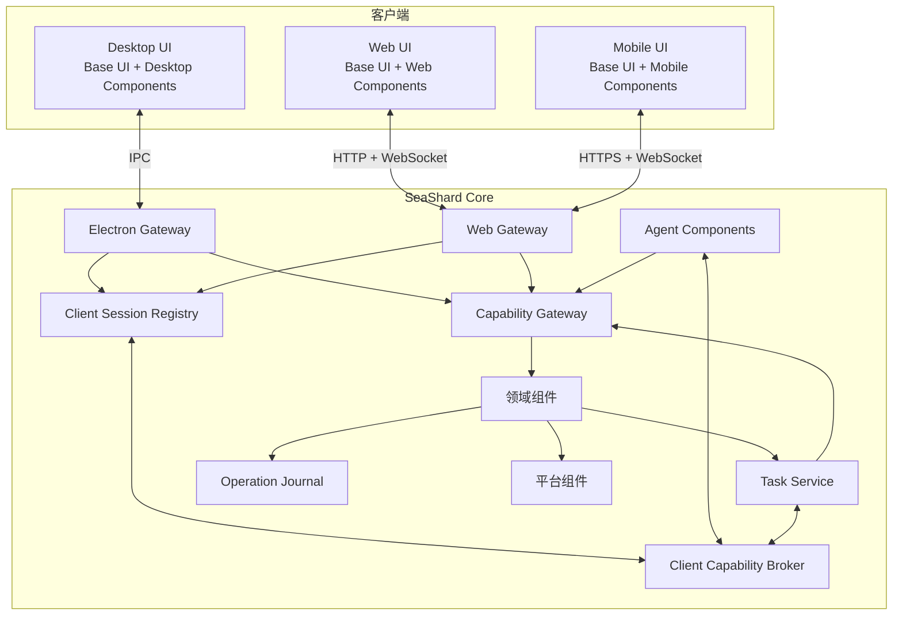

核心关系：

- Core 是权威状态、权限和操作路由中心；
- Desktop 与 Web UI 是组件组合，不是重复业务 Host；
- UI、Agent、自动化和插件调用同一领域 Service；
- Desktop 与 Web Client 也可以向 Core 注册临时交互能力；
- 所有权威操作经过 Capability Gateway；
- 长时间工作进入持久任务系统；
- 影响进程或世界的事实进入 Operation Journal；
- 文件、网络、JVM、密钥和系统能力由少数平台组件集中提供。

## 6. Cordis 与 SeaShard Supervisor 的职责

第一次架构审核发现，旧设计同时让 Cordis 和 SeaShard Runtime 管理生命周期，可能形成两套控制面。本版明确唯一所有权。

| 能力 | 唯一拥有者 |
|---|---|
| 进程内 Context | Cordis Core |
| Service 注册和依赖响应 | Cordis Core |
| Event 注册和副作用释放 | Cordis Core |
| 组件函数的 start/stop/dispose | Cordis Core |
| 插件包校验和入口解析 | SeaShard Supervisor |
| 组件期望状态 | SeaShard Supervisor |
| RuntimeGeneration、Publication Slot 与 Reconcile Operation | SeaShard Supervisor |
| 目标进程与入口选择 | SeaShard Supervisor |
| 权限策略与插件信任等级 | SeaShard Supervisor |
| 控制快照到外部诊断 DTO 的映射 | [Runtime Diagnostics Component](components/diagnostics/runtime/DESIGN.md) |

SeaShard 不实现第二套 DI、事件总线或 Cordis Fiber 状态机。Supervisor 只管理三个比 Fiber 更高层的对象：

```text
RuntimeGeneration
  一个真实插件实例，由 bindingId + generation 唯一标识

Publication Slot
  每个 Binding 当前唯一可以取得新调用租约的 generation

Reconcile Operation
  activate、replace、reload、deactivate 的步骤、结果和恢复信息
```

用户启用意图保存在 Binding；真实加载与清理由 Cordis Fiber 拥有；是否对外服务由 Publication Slot 原子决定。准备候选、排空旧调用和回滚属于 Operation，不再塞进一个全局 `RuntimeUnitState`。Cordis Loader、HMR 和 Node 模块缓存不作为生产正确性前提，插件 Entry 直接声明 `hot-swap` 或 `stop-first`。

## 7. 两段式启动与恢复

不能依赖普通组件期望状态的持久化底座由 Bootstrap Loader 启动；数据库恢复完成后再创建 ComponentSupervisor，组合普通可重载组件。根文档只规定两段式边界，不重复各组件内部的启动、失败和清理设计。

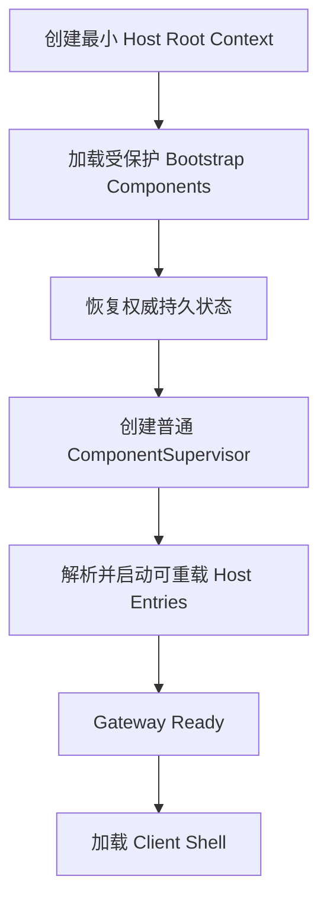

具体依赖、组件判定和交接顺序见：

- [Component 与内部模块判断标准](components/DESIGN.md)
- [SQLite Database Component](components/data/database-sqlite/DESIGN.md)
- [Plugin Foundation](components/plugin/foundation/DESIGN.md)
- [Shared Download](components/network/download/DESIGN.md)
- [Server Core Source](components/server/core-source/DESIGN.md)
- [Runtime Diagnostics](components/diagnostics/runtime/DESIGN.md)
- [Desktop Shell](components/desktop/shell/DESIGN.md)
- [Server Download UI](frontend/server/download/DESIGN.md)
- [Runtime Diagnostics UI](frontend/diagnostics/runtime/src/index.ts)
- [Personalization UI](frontend/settings/personalization/DESIGN.md)
- [About UI](frontend/settings/about/DESIGN.md)

跨组件不变量：

- Bootstrap Loader 只处理固定 Descriptor DAG，不读取普通插件目录或数据库启用状态，也不监督自己；
- 受保护 Foundation 不能禁用、覆盖或热替换；普通产品能力不能进入 Bootstrap Capsule；
- ComponentSupervisor 只在权威 Repository Ready 后创建；
- 普通内置包、官方包、用户包和开发 Overlay 使用同一 Manifest、Binding 和 Supervisor；
- Electron `app.whenReady()`、Root Context、Bootstrap Loader 调用、Supervisor 构造和进程退出保留在最小 Host 壳；
- DTO、Manifest、Schema、Data Capsule 和 Repository Contract 是静态契约，不为“一切皆组件”包装成运行时插件。

### 7.1 当前组件化边界

| 边界 | 决策 |
|---|---|
| 最小 Host / Runtime 底座 | 保留 Root Context、Bootstrap Loader 调用、Supervisor 构造、Plugin Host 与 Worker 进程入口；加载器和监督器不能作为普通插件加载自己 |
| 受保护 Foundation | 使用独立 Bootstrap Component 和故障边界；具体设计见本节组件链接 |
| 可重载内置产品能力 | 与第三方包共用普通 Entry 生命周期；具体设计见本节组件链接 |
| Renderer UI Shell | 已落地每窗口轻量 UI Runtime、Main 发布的 Client Entry Revision、Preload Bootstrap Contract、静态内置 Loader Map 与功能级渐进故障；静态 Shell 逐元素复用 SeaLantern 的布局、CSS Token、尺寸和图标，只固定组织外壳与“首页”，侧栏其余项目来自显式可见的 `navigation.page` Contribution |
| 测试职责 | Smoke 注册、断言和退出调度最终移入测试 Harness/Fixture，不作为产品组件 |

## 8. 插件包与运行单元

### 8.1 Manifest

插件包使用一种通用 Entry 结构，不按 Core、Agent、Tool 或具体页面类型预设字段：

```json
{
  "id": "seashard.server-management",
  "version": "1.0.0",
  "publisher": "sealantern-studio",
  "entries": [
    {
      "id": "server-management.host",
      "runtime": "host",
      "module": "./dist/host.js",
      "hostProfiles": ["electron", "node", "docker"],
      "activationScopes": ["global", "workspace", "server"],
      "permissions": ["server.read", "server.control"],
      "upgradeMode": "stop-first"
    },
    {
      "id": "server-management.client",
      "runtime": "client",
      "module": "./dist/client.js",
      "activationScopes": ["global", "workspace", "server", "client-session"],
      "targets": ["desktop", "web", "mobile"],
      "upgradeMode": "hot-swap"
    }
  ],
  "compatibility": {
    "seaShard": ">=1.0.0 <2.0.0",
    "clientProtocol": ">=1 <3"
  }
}
```

`runtime` 只表达必须由系统预先决定的执行边界：

- `host`：注册领域 Service、Event、Agent Tool、Provider 和后台行为。内置 Entry 可以进入 Core Context；用户安装的外部 Entry 无论如何声明都只能进入独立 Node Plugin Host，不能选择 Electron Main；
- `client`：进入轻量 Client UI Runtime，通过 `targets` 选择 Desktop、Web、Mobile 或它们的组合，并注册页面、槽位、动作和设备交互 Contribution。

Agent Tool、模型适配器、内容源、日志解析器和服务器 Provider 都是 `host` Entry 通过 `ctx` 注册的能力，不再拥有固定入口类型。Base/Desktop/Web/Mobile 仍是 UI 组件和 Target 概念，不再是 Manifest 中必须存在的六个字段。

`activationScopes` 声明 Entry 允许绑定的作用范围，不代表授权。未声明时，Host Entry 默认为 `global`，Client Entry 默认为 `global`；受保护核心组件只能是 `global`。实际绑定由用户配置和 Supervisor 保存，权限仍由 ExecutionContext、Capability Lease 与执行点校验决定。

每个 Entry Module 使用同一运行契约：

```ts
export const inject = ['journal', 'server']
export const Config = schema

export function apply(ctx, config) {
  ctx.provide('server.management', provider)
  ctx.contribute('agent.tool', tool)
  ctx.on('server.started', handler)
  ctx.effect(() => {
    const resource = createResource(config)
    return () => resource.close()
  })
}
```

- `apply(ctx, config)` 是唯一必需入口；
- `inject` 和 `Config` 可选，分别声明依赖与配置 Schema；
- 模块顶层禁止产生副作用，所有资源必须在 `apply` 中通过 Context 创建并归属当前 Fiber；
- Manifest 的 `permissions` 只是 Broker 能力上限；Node Plugin Host 的本机系统访问风险仍由完全信任模型承担；
- 插件实际提供的 Service、Event、Tool 和 Contribution 由运行时代码注册，系统不维护按业务种类扩张的入口枚举；
- Manifest 的目标、权限和兼容性在导入前检查；Loader 导入无顶层副作用的 Module 后读取 `inject` 与 `Config`，再决定等待依赖、拒绝配置或调用 `apply`。运行时注册不能扩大 Manifest 权限上限。

每个 Binding 可以产生多个独立 generation；每个 generation 具有独立身份、Cordis Fiber、依赖、目标、失败结果和生命周期租约。Manifest 的 `upgradeMode` 直接声明候选 generation 能否在旧版本仍运行时启动。确实包含 Native Addon、外部二进制或系统集成时，Manifest 额外声明 `os`、`arch` 和平台制品摘要；安装器只选择当前 Host 有准确制品的 Entry。

### 8.2 发布、组合与运行单元

```mermaid
flowchart LR
    PACKAGE[Plugin Package]
    PACKAGE --> HOST[Host Entry]
    PACKAGE --> CLIENT[Client Entry]

    HOST -->|内置| CORE[Core Context]
    HOST -->|用户完全信任| PHOST[Node Plugin Host]
    CLIENT --> TARGET{Target Selector}
    TARGET --> DESKTOP[Desktop Client]
    TARGET --> WEB[Web Client]
    TARGET --> MOBILE[Mobile Client]

    HOST -.ctx.provide / ctx.contribute.-> CAP[Service · Event · Tool · Provider]
    CLIENT -.ctx.contribute.-> UI[Page · Slot · Action · Device UI]
```

一个包可以贡献任意数量的通用 Entry，但只有跨 Host/Client 运行边界或确实需要独立生命周期时才拆分。一个 Entry 失败不自动意味着整个插件包不可用；只有 Manifest 明确声明原子启停时，Supervisor 才联动多个 Entry。

SeaShard 只有一条插件分发与组合路径：

1. 内置、官方、本地开发目录和用户安装包都解析成同一种 Plugin Package；
2. 包贡献 Entry，Host Profile 和 Client Target 只负责选择当前环境可运行的 Entry；
3. 用户配置、启用状态和开发 Overlay 作用于稳定 Entry ID；
4. Supervisor 生成可检查的最终 Entry Tree，再交给 Cordis 创建 Runtime Unit；
5. 未来公开市场只增加下载、签名、审核和准入，不创建第二套插件格式、缓存或 Loader。

组合层从低到高为内置包清单、已安装插件包、用户启用与配置、临时开发 Overlay。后层可以调整普通 Entry 的配置或替换兼容 Provider，但不可替换最小启动层、Journal、Permission、Secret 和其他受保护权威组件。诊断界面必须显示最终 Entry Tree、来源层、运行位置、依赖、权限、状态和覆盖关系。

本地开发目录直接暴露手写 ESM JavaScript 或 TypeScript/Vue 的开发构建产物，并使用相同的 Entry Module Contract；正式安装则进入不可变版本目录。两者只在来源、信任和更新方式上不同，不存在第二套开发插件 API。

### 8.3 安装与作用范围

插件包版本在 SeaShard 中只安装一份；“给全局、某个工作区、某个服务器或某个 Agent 安装插件”在运行模型中表达为创建作用域绑定，而不是复制包文件或重复运行包管理器：

```text
PluginBinding
├─ entryId
├─ scopeType: global | workspace | server | agent | client-session
├─ scopeId
├─ enabled
└─ config
```

每个 Binding 创建独立的 scoped Runtime Unit，拥有自己的 `runtimeId`、Fiber、generation、配置和清理栈。贡献按 `global → workspace → server → agent/client-session` 查找，近层可以覆盖同键的远层贡献；禁用一个 Binding 只停止该范围，卸载包版本才停止并移除它的全部 Binding。

Entry 必须在 Manifest 中声明自己支持的 `activationScopes`。数据库、Journal、Permission、Secret、Window 和其他权威组件只能全局运行；服务器日志解析器、备份策略、内容源和 Agent Tool 可以按其语义开放更窄范围。Scope 只控制贡献可见性和生命周期，不构成安全边界，也不能扩大调用者权限。

SeaShard 应用插件与 Minecraft 内容继续分开：前者只安装一次后按 Scope 生效；Paper/Spigot 插件、Fabric/Forge Mod、数据包和资源包仍是实际部署到目标实例或服务器的受管理内容。

### 8.4 插件语言、构建产物与依赖

SeaShard 插件的唯一执行格式是预构建的 ECMAScript Module JavaScript：

- TypeScript 是推荐的源码语言，JavaScript 是直接支持的源码语言；
- Host Entry 最终产出 Node Plugin Host 可导入的 ESM `.js`；
- Client Entry 可以使用 TypeScript、Vue SFC 和 CMZ，但安装包中必须已经编译为浏览器 ESM `.js`；
- Loader 不执行 `.ts`、`.tsx`、`.vue`，也不在安装或启动时转译源码。

正式插件使用 ZIP 容器的 `*.seashard-plugin` 文件，解包后与本地开发目录遵循同一布局：

```text
plugin.json
dist/
├─ host.js
└─ client.js
assets/
native/<os>-<arch>-<abi>/
licenses/
```

除 SeaShard 明确提供并进行版本协商的 Plugin API、Vue 和 Client UI SDK 外，JavaScript 依赖必须被 Bundle 进 Entry，或作为包内 `vendor/` 文件通过相对路径引用。插件能力之间通过 Manifest、`inject` 和 Service Contract 建立依赖，不通过用户机器上的 `node_modules` 偶然解析。

PluginInstaller 只校验、解包并原子登记预构建文件，绝不执行 `npm install`、`pnpm install`、`prepare`、`postinstall` 或任意构建脚本。Native Addon 必须由发布者为准确 `os + arch + Node/Electron ABI` 预构建并随包提供，不能在用户机器上现场编译。

插件作者可以使用 npm、pnpm、yarn、bun、Vite+ 或其他工具完成开发；这只是作者自己的构建选择。纯 JavaScript 且无第三方依赖的插件可以不使用包管理器。TypeScript/Vue 作者必须先构建再打包，普通插件使用者始终只需要 SeaShard。


### 8.5 Generation、发布与依赖

SeaShard 不保存一个混合用户意图、加载阶段、停止过程和回滚结果的 Runtime Unit 状态。Generation 只保存自己的物理结果：

```text
prepared
running
failed
terminated
```

同时独立保存：

- Binding 的启用与配置意图；
- 每个 generation 的准确包版本、依赖、Host 和失败原因；
- Publication Slot 当前发布的 generation 与单调递增 epoch；
- Reconcile Operation 的 `running/completed/failed/interrupted` 结果与当前步骤。

规则：

- 组件依赖能力或 Service，不依赖隐含启动顺序；
- 必需依赖缺失时，候选保持 `prepared`，Operation 停在 `wait-dependencies`；
- 依赖环在任何候选 `apply()` 前报告完整链路；
- 未发布 generation 注册的 Service、Event 和 Contribution 对普通调用者不可见；
- Publication Slot 切换后，旧 generation 不能获得新租约，但已取得的租约可以排空；
- 一个稳定能力可以更换实现，但不能静默改变语义；
- 组件不能通过全局单例绕过依赖声明。

### 8.6 Upgrade Mode

- `hot-swap`：在旧 generation 仍发布时启动候选；候选注册进入私有、未发布视图。启动成功后原子切换 Publication Slot，再排空并停止旧 generation。候选启动失败时旧 generation 保持发布。
- `stop-first`：候选只做模块、配置和依赖准备；随后撤下旧 generation，排空租约并完整停止，再启动和发布候选。候选失败时重新创建上一规格的新 generation 进行回滚。

不实现“申报资源后由内核推导策略”。插件作者必须直接选择模式。占用独占端口、文件锁、进程、Native 全局状态或不可逆外部资源的 Entry 必须声明 `stop-first`；声明 `hot-swap` 即承诺新旧实例短暂并存不会争用这些资源。

两个模式都保持单一发布者：同一 Binding 可以同时存在多个 generation，但任意时刻只有 Publication Slot 指向的 generation 能接收新调用、公开 Contribution 或处理 Event。切换后的旧 generation 仅完成已有租约，然后释放 Cordis effects。

## 9. 插件系统

插件系统从第一阶段就确定包格式、ID、入口和生命周期；第一版必须允许用户安装自己开发的或来自他人但由用户明确完全信任的插件包。公开市场、平台审核、签名准入和不可信插件运行时后置。

### 9.1 核心组件

| 组件 | 责任 |
|---|---|
| PluginRegistry | 已安装插件包、版本、期望状态和当前版本 |
| PluginVerifier | 包结构、内容摘要、可选签名、发布者信息和兼容性校验 |
| PluginResolver | SeaShard 版本、入口依赖和冲突解析 |
| ComponentSupervisor | Generation、Publication Slot、Reconcile Operation、启动、切换和排空 |
| PluginInstaller | 安装、升级、卸载和版本目录 |
| PluginPermission | 权限申请、变化比较和用户授权 |
| PluginHost | 管理内置组件、官方组件与用户完全信任插件的独立 Node Plugin Host |
| PluginUI | 插件管理、权限和诊断页面 |

### 9.2 安装与升级

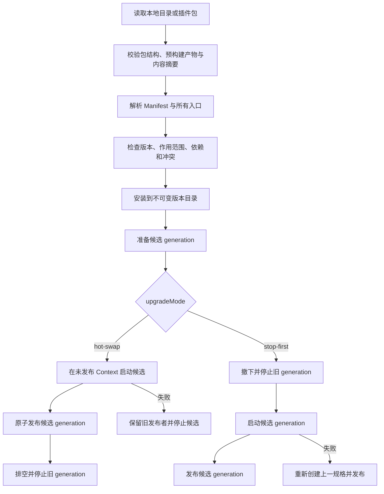

第一版 PluginInstaller 支持从本地开发目录或 `*.seashard-plugin` 文件安装，不依赖公开市场或用户机器上的包管理器。装载信任按可验证身份来源处理：

- 有签名的发布者或更新通道：用户可以信任发布者与通道；签名连续、能力不扩大且没有破坏性数据库迁移时，普通更新不重复弹窗。
- 本地开发目录：信任绑定规范化目录根、插件 ID 和运行位置；目录内预构建 JavaScript 变化可以重载，只有 Manifest 扩大运行位置、作用范围或 Broker 能力上限时重新确认。
- 无签名的独立插件包：没有可持续验证的发布者身份，默认只能把信任绑定到具体版本与内容摘要；新摘要视为新的未知二进制。用户可以显式建立来源规则，但应用不能把“文件名相同”当作同一发布者。

签名者、来源通道、运行 Host、Broker 能力上限、主库集成权限或不可逆迁移发生变化时重新确认。开发目录信任不能自动转移给导出的插件包。

升级不覆盖当前版本目录，也不默认双开。涉及数据库或不可逆外部修改的升级必须明确迁移和回滚限制；无法恢复旧数据格式时，即使旧包文件仍在也不能宣称可以自动回滚。

### 9.3 信任等级

1. 随应用发布的内置组件；
2. Sea Lantern Studio 签名的官方组件；
3. 用户明确授予“本机完全信任”的外部插件，包括用户自己开发的插件和来自他人的插件；
4. 未经用户完全信任的不可信插件，属于未来公开生态范围，第一版不加载。

第一版外部插件进入独立 Node Plugin Host。独立进程只提供崩溃和生命周期隔离，不能阻止插件读取用户文件、联网或启动程序，因此安装界面必须把“完全信任”等同于授予本机代码执行能力，不能把 Manifest 权限描述成安全沙箱。

这里必须分开三种目的，不能都叫“权限”：

- **装载信任**回答“是否允许这段本机代码运行”。对完全信任 Node Plugin，这是唯一真实的 OS 安全决定。
- **Broker Capability**回答“SeaShard 是否替它执行某类领域或平台操作”，用于 Scope、审计、误操作防护和未来受限 Runtime；对完全信任 Node Plugin，它不能阻止代码绕过 Broker 直接使用 Node API。
- **数据所有权规则**回答“谁拥有 Schema、Migration、备份和兼容性”。它主要保护数据库不变量和可维护性，不应伪装成针对恶意代码的沙箱。

用户信任一个插件运行，不等于 SeaShard 必须承诺插件可以直接修改任意 Core 表；这不是怀疑用户判断，而是 Core 表没有面向插件的稳定写入契约。反过来，插件写自己的 namespace、使用自己的存储和执行非破坏性迁移也不应被设计成反复确认的高风险操作。

不可信插件只有在受限 Runtime、权限 Broker、资源限制、逃逸验证、审核和准入机制成熟后才允许加载；当前不建设公开插件市场，也不预先承诺具体受限 Runtime。本项目不支持 Wasm 插件。

### 9.4 第三方 UI

- 普通设置、列表、表单和动作：优先使用声明式 UI Contribution；
- 官方或用户完全信任的复杂 UI：版本锁定的 Vue UI SDK；
- 未来不可信插件的复杂 UI：必须使用独立受限 Renderer 或 iframe，并通过 MessagePort 调用 Broker；
- 禁止把插件提供的任意 HTML 或脚本直接注入主 Vue 树。

### 9.5 与 Minecraft 内容分离

SeaShard 应用插件可以提供新 Service、UI、Agent Tool 和内容源。Minecraft Mod、服务端插件、资源包、光影和数据包只是被管理内容，不获得 SeaShard 应用权限。

## 10. 生命周期 Context 与调用 ExecutionContext

旧设计把 Window、Workspace、Server、AgentSession 和 Component 放进同一棵 Context 树，混淆了组件生命周期与调用权限。本版分开处理。

### 10.1 Cordis Context

Cordis Context 只表达：

- 组件生命周期；
- Service 依赖；
- Event 与 Contribution；
- 资源和清理函数归属。

它不代表当前用户、当前服务器或当前 Agent 权限。

### 10.2 ExecutionContext

每次领域调用显式携带由 Main 签发的 ExecutionContext：

```text
executionId
principal
clientSessionId
agentSessionId
taskId
resourceScope
requestId
correlationId
operationId
capabilities
issuedAt
expiresAt
```

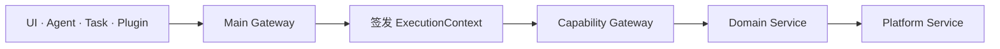

所有下游调用原样传播 ExecutionContext。平台能力只接受受信任 Main 签发的上下文。UI、Agent 和插件不能自行构造或扩大资源范围。

运行在 Main 内的 Node 组件属于完全可信代码。Manifest 权限不是阻止它直接调用 `fs` 或 `child_process` 的沙箱。硬权限只对隔离插件进程、Renderer、Web Client 和远程节点成立。

### 10.3 一次性确认

确认令牌绑定：

- Principal；
- Client Session；
- 具体能力；
- 资源 ID；
- 规范化参数摘要；
- Operation ID；
- 过期时间；
- 单次使用 Nonce。

确认令牌的消费、Operation Intent 写入和操作状态改变在同一个数据库事务内完成，防止确认重放和参数替换。

### 10.4 插件授权与 Capability Grant

“插件通过鉴权”分成三件不同的事，不能只在第一次请求时检查一次后永久放行：

| 阶段 | 发生时间 | 检查内容 | 结果 |
|---|---|---|---|
| 插件身份与装载授权 | 安装、升级、启动 | 包签名、发布者、版本、声明权限、信任等级、运行 Host | 决定插件能否启动，以及它最多可以申请什么 |
| Capability Lease | 插件首次申请某类资源，或 Scope 变化 | Plugin Runtime、generation、能力、资源范围、约束、当前权限 Revision | 返回一个有范围、可过期、可撤销的 opaque handle |
| Operation Grant | 高风险、付费、Secret、世界修改或远程操作 | 精确参数摘要、价格、目标、次数、有效期、用户确认 | 返回一次性或短期授权 |

不是每个 capability 都弹确认框。按风险分层：

| 等级 | 示例 | 用户交互 |
|---|---|---|
| 默认能力 | 自有 namespace 存储、Event、声明式 Contribution、读取公开投影 | 安装说明，不单独确认 |
| 常规授权 | 调用普通领域 Service、访问已选择的 workspace/server、普通网络 Provider | 安装或首次绑定时一次授权，后续自动签发 Lease |
| 集成授权 | 主库插件 namespace Data Capsule、访问 Secret、宿主目录、进程控制 | 明确列出影响；新增或扩大时确认 |
| Operation Grant | 删除世界、恢复备份、付费部署、不可逆迁移 | 绑定精确参数和目标的一次性确认 |

对于完全信任 Node Plugin，文件系统、网络和子进程清单首先是披露与审计，不宣传为硬沙箱。低风险自有存储和 Contribution 不制造权限疲劳；只有能力扩大、跨 Scope、Secret、付费、破坏性操作和主库集成发生变化时要求新的用户决定。

普通调用不必每次重新执行完整数据库权限查询。调用者携带 Capability Lease，Gateway 在执行点快速校验：

```text
grantId
issuer
subject
audience
pluginRuntimeId
generation
capability
resourceScope
constraints
permissionRevision
operationDigest
issuedAt
expiresAt
maxUses
nonce
```

校验至少确认 Handle 存在且未撤销、generation 和 permissionRevision 仍有效、调用目标属于 resourceScope、参数满足 constraints、次数与期限未超过。插件升级、权限修改、用户撤销、Host 重启或 Runtime Unit 停止时，相关 Lease 立即失效。

同一受限插件获得 `server.control` on `server-a` 后，可以在 Lease 期限内反复执行允许的低风险控制，不需要每次弹窗；但它不能把目标换成 `server-b`，也不能把 `restart` 换成 `world.restore`。付费部署、删除远程资源、扩大套餐、恢复世界和使用 Secret 仍需绑定精确 Operation Digest 的一次性 Grant。

Capability 只在跨进程或跨网络时编码为签名 Grant，并绑定 `audience`，防止给 Plugin Host 的授权被拿到商业云 API 使用。Core 内部优先传递不可伪造的 opaque handle，不把 Bearer Token 散布到日志和数据库。签名 Grant 的验证可以本地完成，但撤销、权限 Revision 和用量仍由权威方管理。

运行于 Main 或完全信任 Node Plugin Host 的代码仍具有宿主系统权限，Capability Gateway 只能约束它主动经过 Broker 的调用，不能阻止它绕过 Broker 直接使用 Node API。因此“装载后长期 Lease”只对受限插件、Renderer、Client 和远程 Workload 构成硬安全边界。

## 11. 资源归属与自动清理

组件创建的临时副作用登记在自己的 Cordis 生命周期中：

- 事件监听；
- 定时器；
- 文件监听器；
- IPC Handler；
- 菜单、托盘和快捷键；
- UI Contribution；
- Service、Tool 和 Client Capability Provider 注册；
- 临时订阅和消息通道。

停止组件时：

1. 进入 `quiescing`；
2. 从 Registry 撤下，拒绝新调用；
3. 请求已有调用协作取消或结束；
4. 运行组件主动关闭逻辑；
5. Cordis 逆序撤销剩余副作用；
6. 释放 Context；
7. 验证没有残留登记项。

持久任务和 JVM 进程不是普通生命周期副作用。它们由领域 Runtime 和 TaskService 记录管理。组件卸载前必须完成交接、等待结束或拒绝卸载，不能直接释放仍在使用的 Provider。

## 12. 多平台 Host、Client 与 Headless

### 12.1 Core 不直接依赖 Electron

Minecraft 领域组件、Journal、Task、Agent 和插件系统不能 import Electron。Electron 能力放在独立 Desktop 组件中。

```text
SeaShard Core
├─ 可运行于 Electron Main
└─ 可运行于普通 Node Host

Electron Host
├─ Window
├─ Tray
├─ Native Dialog
└─ Electron Gateway

Web Host
├─ HTTP
├─ WebSocket
├─ Auth
└─ Static UI Assets
```

Electron Desktop 是第一个运行纵切；Docker Headless Host 与 Web UI 是正式支持的第二个部署目标，不作为部署完成后的临时封装。普通 Node Headless Host 复用同一入口和 Host Profile；Mobile 始终作为远程 Client 连接这些 Core Host。

### 12.2 Main Process

Main 只保留 Electron 进程级宿主职责：`app.whenReady()`、Root Context、Bootstrap Loader、ComponentSupervisor 构造、第二阶段启动屏障和 `before-quit`。领域能力、窗口策略、IPC 投影和持久化实现由组件提供。

当前 Desktop 组件边界见：

- [Desktop Shell](components/desktop/shell/DESIGN.md)
- [Runtime Diagnostics](components/diagnostics/runtime/DESIGN.md)

### 12.3 Preload

Preload 只暴露按 Contract 生成或绑定的有限接口，不暴露：

- `ipcRenderer`；
- `require`；
- Node.js 文件系统；
- Cordis Context；
- 任意字符串方法名的通用 RPC；
- 允许 Renderer 自行判断权限的接口。

### 12.4 Web Gateway

Web UI 是按需启用的组件：

```text
enabled: false
bind: 127.0.0.1
remoteAccess: false
```

用户启用后：

```text
启动 Web Gateway
→ 建立 Auth 与 Session
→ 提供 Web UI 静态资源
→ 开放 HTTP Contract 和 WebSocket 投影
→ 显示本地地址与登录方式
```

局域网或公网访问必须显式启用，并处理登录、TLS 或反向代理、Origin、CSRF、WebSocket 鉴权、限速、Session 撤销、上传上限和审计。

### 12.5 独立子进程

第一版只有一种外部插件子进程：

- Node Plugin Host：用于官方和用户明确完全信任的 TypeScript/JavaScript 插件，以及 CPU 密集的官方任务；拥有普通 Node 进程的系统访问能力，因此权限提示必须明确；
- Node Plugin Host、Electron Utility Process 和 Node Worker 只提供故障隔离，不提供安全隔离；
- 未来若支持未经完全信任的插件，必须另行实现并验证 Restricted Plugin Host，不能把现有 Node Plugin Host 改名后宣称为沙箱。

### 12.6 Host Profile

宿主差异由启动时选择的 Host Profile 组件集合表达，不进入领域组件：

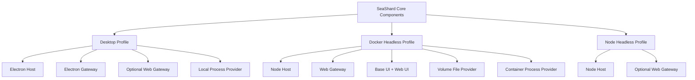

Host Profile 只选择平台 Provider，不复制领域组件。Desktop 和 Docker 使用同一 InstanceService、ServerRuntime、Agent、Journal、Task 和 Plugin Supervisor。

### 12.7 Docker 适配范围

仅把静态 Web UI 放进容器几乎不需要特殊适配；构建后可由任何静态服务器提供。但完整 SeaShard Web 产品还包含 Core、SQLite、Artifact、Plugin Host、Agent 和 Minecraft 进程管理，因此 Docker 必须是一等 Host，而不是只写一个 Dockerfile。

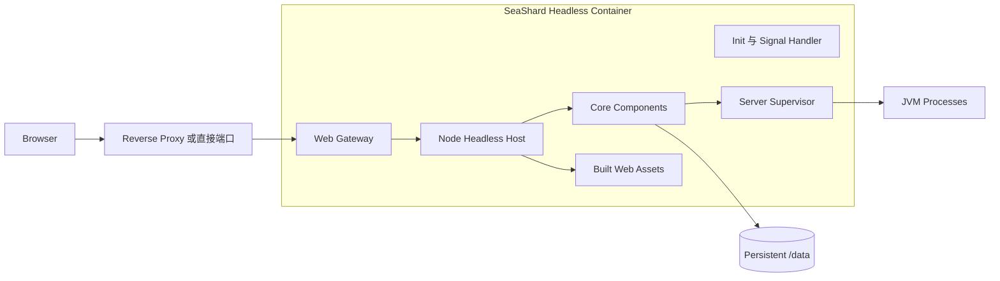

Docker Headless Profile 的特殊规则：

- 容器内 Web Gateway 监听 `0.0.0.0`，但必须启用 Auth；Desktop 本机 Web Gateway 仍默认监听 `127.0.0.1`；
- 提供 `/health/live` 和 `/health/ready`，前者表示进程存活，后者要求数据库迁移、Journal 恢复和关键组件完成启动；
- 使用非 Root 用户运行，数据目录的 UID/GID 必须可配置或在启动前校验；
- 以 `/data` 作为持久根目录，数据库、插件、Artifact、Workspace、备份和 Java Runtime 使用其下稳定子目录；
- 外部 Minecraft 目录通过显式 Volume 挂载并转换成 ResourceRef，不能把宿主绝对路径直接写进领域数据；
- 容器停止时先停止接受新请求，取消或挂起任务，刷新 Journal，再向 Server Supervisor 发送有界关闭；超时后由容器 Runtime 强制终止；
- 使用 Init 进程或等价 PID 1 处理，确保信号转发和孤儿子进程回收正确；
- 使用 Debian/Distroless 等 glibc Runtime；SQLite Driver、QuickJS Binding 和其他 Native Addon 不从 Windows 或 macOS 复制，必须在目标 Linux Architecture 构建；
- `linux/amd64` 与 `linux/arm64` 分别构建、验证 Native Addon 和 Java Runtime；
- Plugin Host 看到的是容器文件系统，但可信 Node Plugin 仍可访问全部挂载 Volume，因此 Docker 不能替代插件信任分级。

### 12.8 Docker 中的 Minecraft 执行方式

Docker 支持两个可替换的 Server Execution Provider：

| Provider | 行为 | 适用场景 |
|---|---|---|
| EmbeddedContainerProcessProvider | Server Supervisor 和 JVM 运行在 SeaShard Core 容器中 | 单机、少量服务器、最少部署依赖 |
| DockerOrchestratorProvider | 每个 Minecraft 服务端运行在独立容器 | 多服务器、独立资源限制和滚动维护 |

首个 Docker 纵切使用 EmbeddedContainerProcessProvider，不要求访问 Docker Socket。容器需要发布服务器端口或预留明确端口范围。

DockerOrchestratorProvider 是后续官方插件。它不能默认挂载原始 `/var/run/docker.sock`，因为该 Socket 基本等同宿主 Root 权限。正式实现使用受限 Docker Socket Proxy，或经 mTLS 连接独立执行 Agent，并把容器、Volume、Port 和 Resource Limit 作为 Operation Journal 中的受控计划。

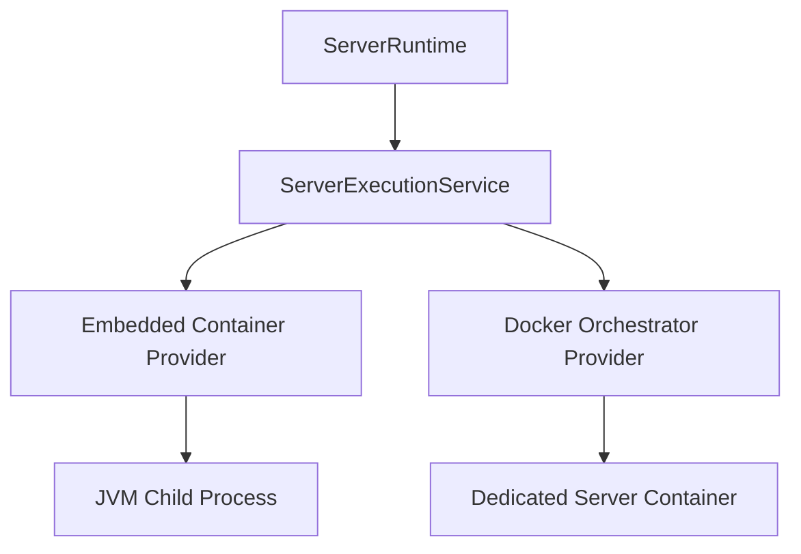

### 12.9 Vite+ Docker 构建

构建采用三个阶段：

```text
Vite+ Build Stage
→ vp install --frozen-lockfile
→ 构建 Web UI 与 Headless Core

Production Dependencies Stage
→ 独立执行 vp install --frozen-lockfile --prod

Runtime Stage
→ 复制精确 Node Runtime
→ 复制 Headless Core、Web Assets 和生产依赖
→ 不复制 Vite+、源码和开发依赖
```

Builder Image 固定准确 Vite+ Tag 或 Digest，不能在 Release 使用 `latest`。Vite+ 官方 Image 是 glibc、非 Root `vp` 用户，并带 Native Addon 构建工具；复制源码时需要正确 Ownership。若 Headless Core 最终能够完全 Bundle 且没有外置 Native Runtime Dependency，生产镜像可以不复制完整 `node_modules`。

### 12.10 Host、Client 与 Execution Node

多端支持首先区分角色，而不是只区分操作系统：

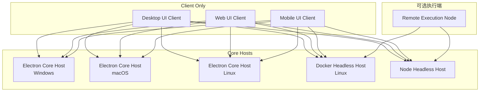

角色规则：

- Core Host：唯一拥有数据库、Journal、Task、Agent、插件监督、JVM 和权威状态；
- Desktop UI Client：可以与本机 Electron Core 同进程族运行，也可以连接远程 Core；
- Web UI Client：通过 HTTPS/WSS 连接 Core；
- Mobile UI Client：严格 Client Only，只提供显示、输入、文件上传、相机、通知和确认；
- Execution Node：将来用于远程机器上的受控文件、JVM 和日志能力，不与普通 Mobile Client 混用。

`client-only` 是服务端权限和构建产物约束，不只是隐藏按钮。Mobile 包不包含 Core、Cordis Main Runtime、Java、ProcessService、Plugin Host 和 Server Supervisor；即使客户端伪造请求，Core 也拒绝 Host 级能力。

### 12.11 Desktop 操作系统 Provider

领域组件只依赖平台能力，Host Profile 为各系统选择实现：

| 能力 | Windows | macOS | Linux |
|---|---|---|---|
| Process Control | Windows Job/Process Provider | POSIX Process Group Provider | POSIX Process Group Provider |
| Secret Store | Windows Credential Provider | Keychain Provider | Secret Service Provider；缺失时明确降级 |
| Native Dialog | Windows Dialog Provider | macOS Dialog Provider | Linux Portal/Dialog Provider |
| Open Folder | Explorer Provider | Finder Provider | Desktop Portal/File Manager Provider |
| Notification | Windows Notification | macOS Notification | Desktop Notification Provider |
| Auto Start | Windows Startup Provider | Login Item Provider | Desktop Auto Start Provider |
| Update | Windows Signed Package | macOS Signed/Notarized Package | AppImage、deb 或 rpm Provider |

路径、信号、可执行权限、符号链接、文件名大小写和系统密钥库差异不得进入 InstanceService、ServerRuntime 和 Agent Tool。它们由 FileService、ProcessService、SecretService 和 Desktop Integration Provider 吸收。

Linux 环境不能假设存在桌面、Secret Service、systemd 或某个固定文件管理器。Capability 缺失时对应组件进入 `waiting` 或提供明确降级，不创建虚假的成功实现。

### 12.12 构建与发布平台矩阵

首批目标：

```text
windows-x64
macos-x64
macos-arm64
linux-x64
linux-arm64
docker-linux-amd64
docker-linux-arm64
web
mobile-web
```

Electron 安装包、Native Addon、Java Runtime 探测和系统集成必须在对应系统的原生 CI Runner 验证，不能假设一次 Windows 构建可以产出所有平台。macOS Release 需要签名和 Notarization；Windows Release 需要代码签名；Linux 分发格式作为独立 Provider 处理。

JavaScript Bundle 可以复用，但 Native Addon、Restricted JavaScript Runtime Binding 和 Electron Native Dependency 必须按 `os + arch + Node/Electron ABI` 构建和校验。

### 12.13 商业云的 Control Plane 与 Hosted Host

一键远程部署不让 Desktop 直接操作 Kubernetes、Docker 或云厂商 API。SeaShard 商业团队运行独立 Control Plane，客户端通过官方签名的 `ManagedDeploymentProvider` 调用它：

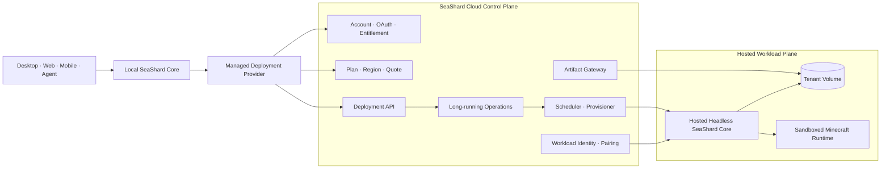

首个商业版本采用“每个用户或 Workspace 一个 Hosted Headless SeaShard Core”，而不是先开发另一套多租户 Minecraft 领域后端。这样复用现有 Docker Headless Host、Client Protocol、Journal、Task、Plugin Supervisor、Web UI 和 Mobile 配对能力。

权威状态严格分开：

- Cloud Control Plane：账户、会员权益、价格、配额、区域、基础设施 Deployment、网络入口和 Workload 身份；
- Hosted Headless Core：Minecraft 实例、服务端、插件、世界、任务、Journal 和 Agent Session；
- Local Core：本机实例和本机任务，以及远程 Host 连接信息；不冒充远程 Minecraft 状态的权威来源。

Control Plane 的 API 必须覆盖远程资源完整生命周期；本地官方插件只是类型化适配器，不把云端状态机复制到客户端。第三方插件可以消费通用 `DeploymentProvider` Contract，但不能取得 SeaShard 云管理员 Credential。

Core 从现在开始保留通用 `DeploymentProvider` Contract：

```text
plan(spec)
getQuote(plan)
create(plan, grant, idempotencyKey)
get(deploymentId)
list()
watch(deploymentId, revision)
suspend(deploymentId, grant)
resume(deploymentId, grant)
resize(deploymentId, quote, grant)
delete(deploymentId, grant)
createPairingInvitation(deploymentId)
```

商业云 API 实现完整 Contract，`ManagedDeploymentProvider` 只完成身份、Schema、错误和 Operation 映射。后续其他厂商或用户自托管平台可以实现相同 Contract，但不会被允许伪装成 SeaShard 商业 Entitlement。

### 12.14 一键远程部署流程

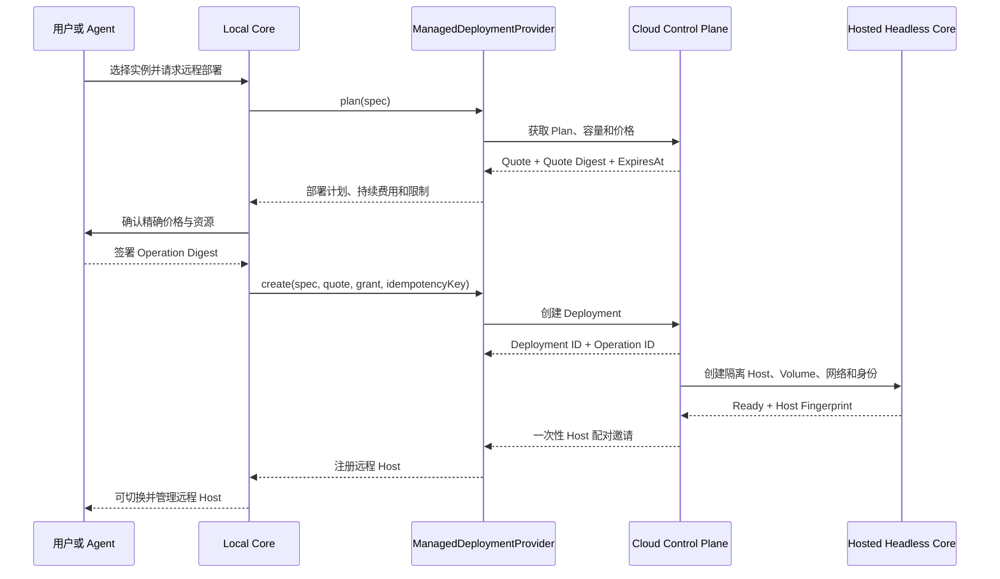

规则：

- `plan` 不产生费用和远程副作用；`create`、`resize`、`suspend`、`resume`、`delete` 返回可查询、可订阅的 Long-running Operation；
- 所有创建和变更请求携带 Idempotency Key，网络重试不能重复扣费或创建两个 Deployment；
- 付费 Operation Grant 绑定账户、会员、Quote ID、价格、币种、套餐、区域、资源规格、Artifact Digest、有效期、`audience`、Nonce 和 `maxUses=1`；
- Agent 使用与 UI 相同的 `DeploymentProvider`，可以生成方案，但不能跳过持续费用确认、扩大资源或改变 Quote；
- 大文件通过短期 Artifact Upload Session 直传对象存储，不经 Control Plane 主 API 转发；
- Provision 完成后，客户端使用一次性邀请与 Hosted Core 建立设备身份；不复用 Control Plane Access Token 作为长期 Host Credential；
- 会员到期、欠费、容量不足和平台维护分别建模。到期不能立即删除用户世界；采用明确的只读、暂停、宽限、导出和最终删除策略；
- Cloud Deployment 与 Hosted Core 都有稳定 ID，双方只保存对方引用和投影，不共享数据库。

### 12.15 Hosted Workload 隔离

用户上传的 Mod、服务端插件和自定义 JAR 都按不可信代码处理。普通容器共享宿主 Kernel，不是足够强的多客户硬隔离。正式商用前必须在目标 JVM、Mod Loader 和性能负载下验证 Sandboxed Container、Userspace Kernel、MicroVM 或独立 VM；高隔离套餐可以使用专用 Node 或 VM。

每个 Tenant Workspace 至少具有独立：

- Namespace 或等价资源边界；
- Workload Identity 与短期凭据；
- Volume、备份密钥和 Artifact Scope；
- CPU、内存、磁盘、带宽和端口配额；
- 默认拒绝的东西向网络策略与受控 Egress；
- 日志、审计、计费标签和删除策略。

Hosted Core 和 Minecraft Runtime 不获得集群管理员权限，不挂载原始 Docker Socket。Control Plane 通过 Provisioner 管理基础设施；Workload 使用短期身份访问自己的 Artifact、备份、模型 API 和事件通道。Kubernetes 官方多租户指南明确指出共享集群需要 RBAC、Quota、Network Policy 和数据面隔离，运行不可信代码时应考虑 Sandboxing 或 VM 边界。

参考：[Kubernetes Multi-tenancy](https://kubernetes.io/docs/concepts/security/multi-tenancy/) · [SPIFFE Workload Identity](https://spiffe.io/docs/latest/spiffe-about/overview/) · [Long-running Operations](https://google.aip.dev/151)


## 13. UI 组件架构

### 13.1 组合方式

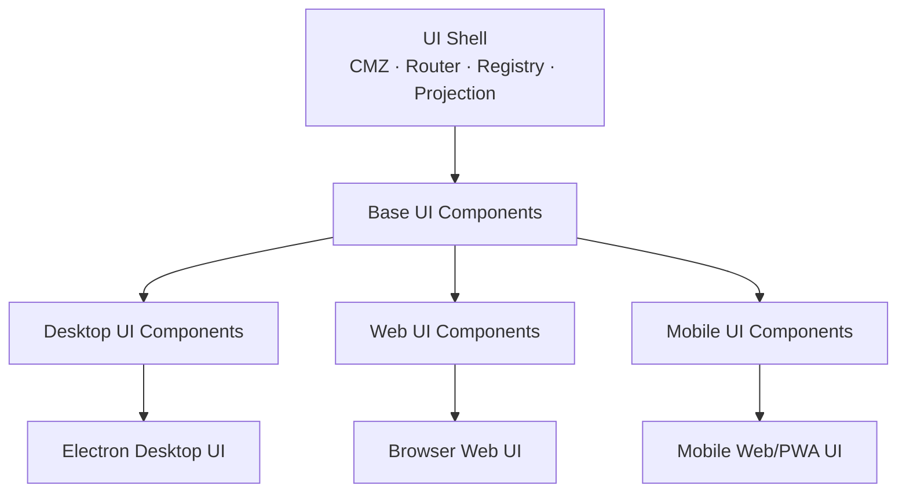

不是面向对象继承，而是依赖和槽位组合：

```text
Desktop UI = Shell + Base Feature Components + Desktop Contributions
Web UI     = Shell + Base Feature Components + Web Contributions
Mobile UI  = Shell + Base Feature Components + Mobile Contributions
```

Mobile 初期以独立 `ui-mobile` PWA Target 交付，复用 Vue、CMZ、Client Contract 和 Projection。未来若增加原生移动 Shell，只替换 Mobile Transport 和 Device Provider，不允许在移动端嵌入 Core。

### 13.2 轻量 UI Component Runtime

UI Runtime 只负责：

- UI 入口依赖；
- 目标筛选：`ui-base`、`ui-desktop`、`ui-web`、`ui-mobile`；
- Vue Effect Scope；
- 路由、页面、动作和槽位注册；
- UI 订阅释放；
- 组件错误隔离；
- Component Contribution 移除。

UI Runtime 不负责：

- Minecraft 领域状态；
- 权限最终判断；
- Journal；
- 持久任务；
- JVM；
- Agent Tool 执行；
- Main Service 生命周期。

Main 和 UI Runtime 不共享 Context，也不共同拥有同一个 Runtime Unit。Main 发布组件期望状态、投影和允许激活的 UI 入口，UI Runtime 管理本地 Vue 生命周期。

Desktop 当前采用每个 `BrowserWindow/WebContents` 一套 UI Runtime。Main 将安全收窄后的 Client Entry Publication 通过 Preload 快照和 revision 更新发布；内置 Entry 由 Renderer 静态 Loader Map 解析，外部 Entry 在安全资源协议完成前不宣称可加载。可见静态 Shell 复用 SeaLantern 的 AppLayout、AppSidebar、AppHeader 几何、CSS Token 和图标，只拥有组织外壳、默认“首页”、工作区侧栏挂载位和 Renderer 级 Service；功能页面由 Client Entry 的 `navigation.page` Contribution 生成路由与设置导航，功能工作区侧栏由 `workspace.sidebar` Contribution 提供。单个功能 Entry 激活或渲染失败不阻塞 Shell。

“个性化”是独立内置 Client UI Entry，只拥有设置页面和页面内交互；它通过 `UiAppearanceService` 读取和修改外观，不直接拥有主题持久化或全局 CSS 副作用。当前 Renderer 级 Appearance Service 负责 `localStorage`、系统深浅色监听和 CSS Token，静态标题栏与个性化页面都是消费者。未来字体枚举、原生文件选择器和窗口材质继续通过收窄 Service 提供，不把 Electron 或 Node 能力交给功能页面。

“关于”同样是独立内置 Client UI Entry，已提供版本、桌面技术与运行时设计信息。它与“个性化”都使用 `navigation.page.placement = settings`，由 Shell 的设置模式统一生成导航；页面路由、生命周期和来源仍归各自 Entry。

桌面 Shell 已实现 `Agent / 服务器 / 启动器` 三工作区布局骨架。Agent 对话 Client Entry 同时发布自己的页面与 `workspace.sidebar`，会话、草稿、项目展示和侧栏交互都保留在该 Entry 生命周期内；Shell 只按当前工作区挂载完整侧栏组件。服务器工作区“下载”已连接独立 Client Entry，通过类型化 Client Service 读取对应领域能力；后续页面和工作区侧栏继续通过明确 UI Contract 与 Contribution 接入。

标题栏右侧使用面板开关代替产品状态胶囊。右侧栏展开时占用与左侧栏相同的宽度并通过 Flex 布局收窄中间内容，不覆盖内容；当前右侧栏为空，不声明尚未实现的检查器、上下文或任务能力。

### 13.3 功能优先的 UI 目录

```text
components/instance/
├─ catalog/
├─ installer/
└─ ui/
   ├─ base/
   ├─ desktop/
   ├─ web/
   └─ mobile/

components/server/
├─ core-source/
├─ runtime/
└─ ui/
   ├─ base/
   ├─ desktop/
   ├─ web/
   └─ mobile/
```

不要建立一个容纳所有页面业务的巨大 `ui-base` 包。每个功能组件拥有自己的 Base 和实际支持的目标 UI。Mobile 不是把 Desktop 页面缩窄，而是可以选择更少、更聚焦的 Feature Component。

### 13.4 Base 与平台专属页面

适合共享：
- 实例和服务器摘要；
- Agent 对话；
- 任务状态；
- Mod 和插件基本信息；
- 操作历史和告警。

适合共享主体、替换局部：

- 整合包导入；
- 文件管理；
- 备份导出；
- 日志查看；
- 服务器控制台。

Desktop 专属：

- 窗口、托盘、开机启动；
- 系统协议和文件关联；
- 本地 Java 与文件管理器集成；
- 本机启动 Minecraft 和本机服务端。

Web 专属：

- 登录、Session 和远程访问；
- TLS 与反向代理设置；
- 在线用户、登录历史和连接状态；
- 大文件上传与浏览器下载。

Mobile 专属：

- 主机配对和切换；
- 服务器与实例状态卡片；
- Agent 对话；
- 启停、备份和维护审批；
- 告警、推送入口和生物识别确认入口；
- 相机扫码、文件上传和简化日志；
- 网络断开、后台恢复和待处理交互。

Mobile 不显示本地 Java、宿主目录、托盘、窗口、启动本机 Minecraft 和创建本地 Core 的能力。平台体验明显不同时保留独立组件，不用大量响应式条件分支强迫共享。

### 13.5 导入整合包示例

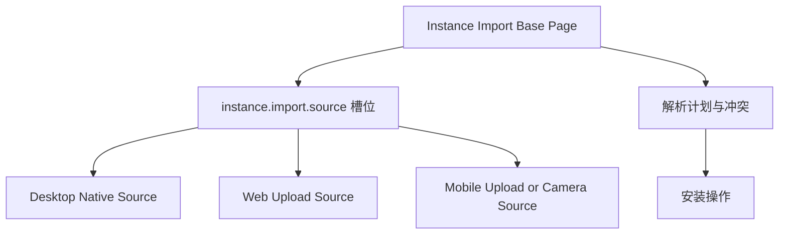

Base Page 负责标题、解析计划、冲突、Java 要求、进度和安装动作。Desktop 贡献原生文件窗口；Web 贡献浏览器上传和后端文件浏览；Mobile 贡献系统文件选择、分享入口和相机扫码。

### 13.6 UI Contribution

规划中的固定槽位：

```text
navigation.page
workspace.sidebar
navigation.item
page.section
page.action
settings.section
command.action
status.item
dialog.provider
interaction.provider
agent.resultRenderer
```

UI Contribution 作为 Client Entry 能力注册记录。当前 UI Runtime 已实现 `navigation.page` 与 `workspace.sidebar`：前者生成动态路由及设置导航，`navigation: false` 可以保留可路由页面但不进入导航，`placement: "settings"` 把可见页面放入 Shell 的设置模式导航；后者让一个 Entry 为指定工作区独占提供完整侧栏组件。侧栏与发布它的 Entry 共用激活、失败隔离和注销生命周期，Shell 不读取其领域状态。其余槽位在对应 Contract 与清理语义落地前只保留为设计，不提供任意注入入口。

### 13.7 CMZ

- 使用与 SeaLantern 相同的准确 CMZ 版本；
- AppLayout、AppSidebar、AppHeader 的页面元素、尺寸、间距、圆角、颜色、字体和交互状态直接采用 SeaLantern 的同名 CSS Token 与规则；
- 组织应用图标和 Lucide 图标选择保持一致，仅替换产品名称；
- 不另建一套“相似风格”的 SeaShard 视觉 Token，也不复制组件库兜底样式；
- 页面不能各自重新定义按钮、卡片、弹窗和空状态。

## 14. Desktop、Web 与 Mobile 的后端连接

Base UI 依赖统一 Client Contract。Desktop 使用 Electron IPC；Web 和 Mobile 使用 HTTPS + WebSocket。未来原生 Mobile Shell 仍使用同一 Client Protocol。

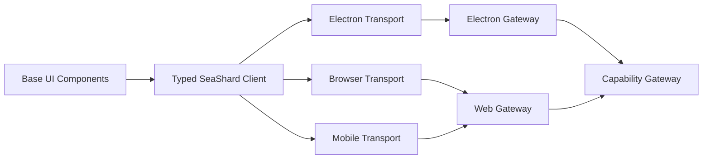

差异只停留在 Transport、Gateway 和目标 UI Component，不进入领域 Service 和 Pinia Store。

### 14.1 Client Contract

每项 Contract 具有：

- 固定 ID；
- 明确的输入与输出类型；
- 用于拒绝非法 Client 请求的输入 Schema；
- 可选的 Service 返回值校验器；
- 明确错误类型；
- 调用者身份；
- 资源范围；
- requestId 与 correlationId；
- 超时、取消和幂等语义；
- 引入版本和废弃版本。

禁止只有一个 `/invoke` 加任意字符串和任意 JSON 的万能入口。Contract Registry 是显式白名单，可用于绑定 IPC、HTTP、Client 和测试工具。

Client 请求的输入校验属于 Gateway 边界；Service 返回值的领域语义校验遵循第 17.1 节并保持可选。Contract 已经返回 Client DTO 时，组件声明的可选返回 Schema 直接作为该方法的返回值校验器，不建立独立的 Client DTO Schema 体系。

页面可以知道 UI 环境并调整信息结构，但具体系统操作通过目标 UI Component 或 Client Capability Provider 完成，不能散布 `window.electron`、`fetch`、Android 和 iOS 条件分支。

### 14.2 协议握手与版本兼容

移动应用经过应用商店更新，版本通常落后于 Core，因此 Client Protocol 不能与产品版本强绑定。连接握手包含：

```text
clientId
deviceId
clientType
clientVersion
protocolMin
protocolMax
uiTargets
os
arch
locale
capabilities
contractSchemaDigest
resumeToken
```

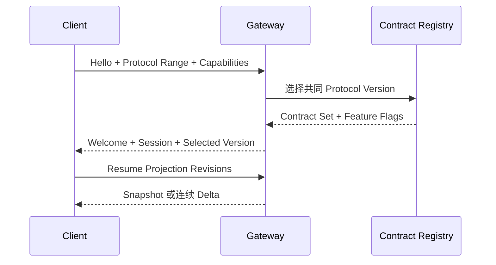

Core 同时维护当前协议与明确的兼容窗口。新增字段必须可忽略或具有默认语义；破坏性变化使用新 Contract Version。没有共同版本时返回结构化升级原因，不建立半兼容 Session。

Capability 协商优先于客户端类型。旧 Mobile Client 可以继续使用它理解的 Contract；新功能根据 Feature Flag 隐藏。权限判断仍在 Core，不能因为旧客户端没有显示风险字段就降低确认要求。

### 14.3 Mobile 配对与设备身份

Mobile 首次连接不能只输入一个裸 Token。推荐流程：

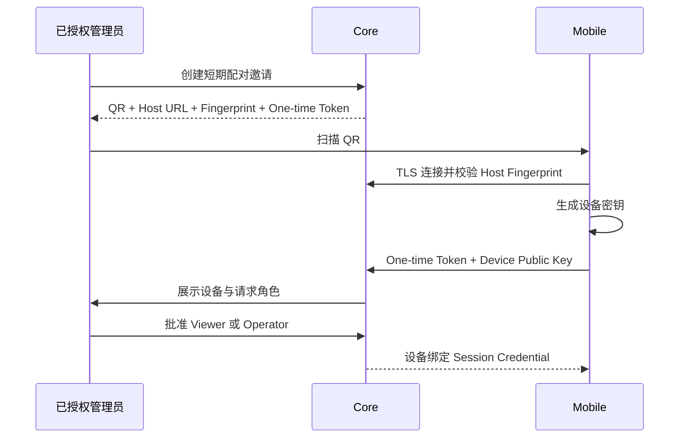

规则：

- One-time Token 短期、单次使用，不能成为长期凭据；
- Core 保存设备公钥、用户、角色和撤销状态；
- Mobile 安全保存设备私钥或受保护 Credential；
- 远程连接必须使用 HTTPS/WSS，并校验 Host 身份；
- mDNS 或局域网发现只用于找到地址，不建立信任；
- 丢失手机后可以从任一管理员 Session 撤销设备；
- 生物识别只解锁本地设备密钥，最终授权仍由 Core 根据 Operation Digest 决定。

### 14.4 移动网络与后台限制

Mobile Client 可能频繁断线、切网和进入后台：

- Projection 使用 Revision 和 Resume Token 恢复；
- Command 使用 Idempotency Key，重连不能重复执行；
- Client Capability Lease 在后台或断线时过期；
- 等待 Mobile 确认的操作进入 `waiting-client`，不能假装已拒绝或自动通过；
- 上传使用可恢复 Artifact Session；
- 后台推送不是 Core 正确性的前提；没有推送服务时，用户重新打开客户端后恢复待处理交互；
- 将来若加入 Push Relay，必须可选、端到端最小化数据，并与 Core 权限体系分离。

## 15. 双向客户端能力贡献

### 15.1 核心思想

> 每个已认证、已连接的程序，不仅可以使用 Core 能力，也可以在自己的权限和生命周期范围内向 SeaShard 提供能力。

这不是无中心对等网络。所有注册、调用、授权和结果校验都经过 Core。

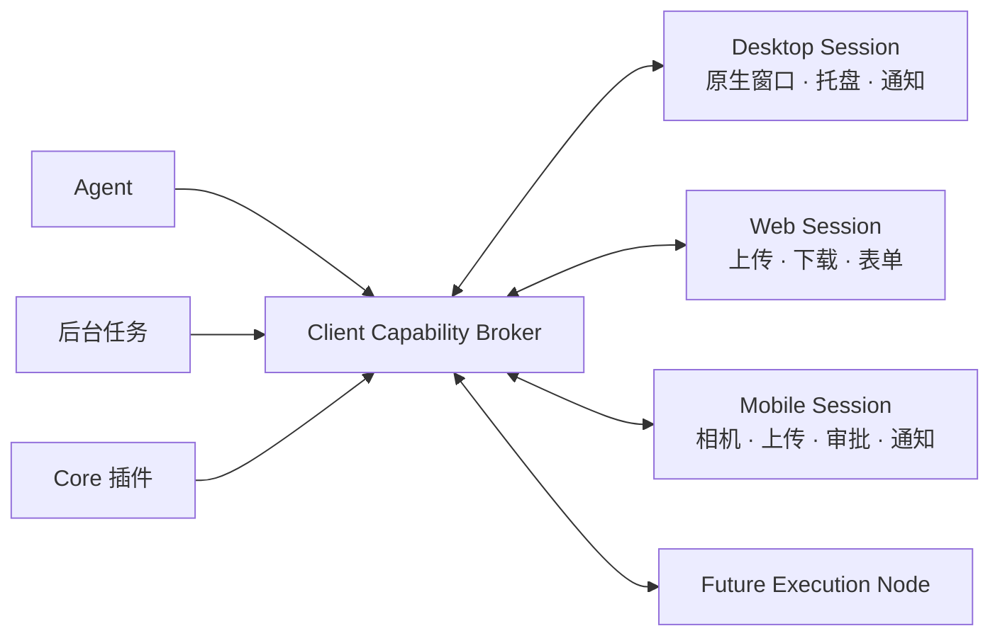

Desktop、Web 和 Mobile 属于 Client Capability Provider；Execution Node 属于单独信任等级，不能借用普通 Client Session 注册 `node.execution.*`。

### 15.2 核心组件

| 组件 | 责任 |
|---|---|
| ClientSessionRegistry | 连接、用户身份、在线状态和交互所有者 |
| ClientCapabilityBroker | Provider 注册、租约、选择、调用和取消 |
| InteractionService | 文件、确认、登录和表单等交互请求 |
| InteractionProjection | 等待中的交互和交接状态 |
| DesktopInteractionProviders | 原生文件窗口、保存窗口和桌面通知 |
| WebInteractionProviders | 浏览器上传、下载、表单和 Web 登录 |
| MobileInteractionProviders | 相机扫码、移动文件、审批、生物识别入口和移动通知 |

### 15.3 Provider 注册

每个 Provider 绑定到某次 Client Session：

```text
capability
version
sessionId
principalId
providerId
generation
leaseId
expiresAt
maxConcurrency
trustClass
```

Provider 不是永久 Service。Client 断开、窗口销毁、UI 组件卸载或心跳超时时，租约失效并自动注销。

### 15.4 能力类别

| 命名空间 | 允许提供者 |
|---|---|
| `core.domain.*` | Core 内置或官方可信领域组件 |
| `client.interaction.*` | 已认证 UI Session |
| `client.device.*` | 具备对应设备能力的 UI 组件 |
| `node.execution.*` | 将来经过注册和授权的远程执行节点 |
| `agent.reasoning.*` | Agent 组件 |
| `plugin.extension.*` | 已安装插件进程 |

普通 Client 不能声称自己提供 `core.domain.server.start` 或 `permission.grant`。

### 15.5 交互所有者

Agent Session 和交互式任务保存：

```text
interactionOwnerSessionId
```

默认把文件选择、确认和表单请求发给发起当前操作的 Client Session。不能使用第一个在线 Client，也不能向所有窗口同时弹出敏感请求。

交互所有者断开后，操作进入：

```text
waiting-client
requires-handoff
expired
cancelled
```

用户可以在新的 Session 中明确接管，Broker 重新签发调用，旧调用结果失效。

### 15.6 调用协议

一次 Client Capability 调用包含：

```text
callId
capability
providerId
providerGeneration
targetSessionId
principal
input
deadline
operationId
operationDigest
nonce
```

结果：

```text
succeeded
cancelled
rejected
expired
provider-disconnected
provider-failed
```

Core 只接受一次有效结果，并检查 Provider generation、Session、Nonce、Deadline 和 Operation Digest。

### 15.7 文件选择流程

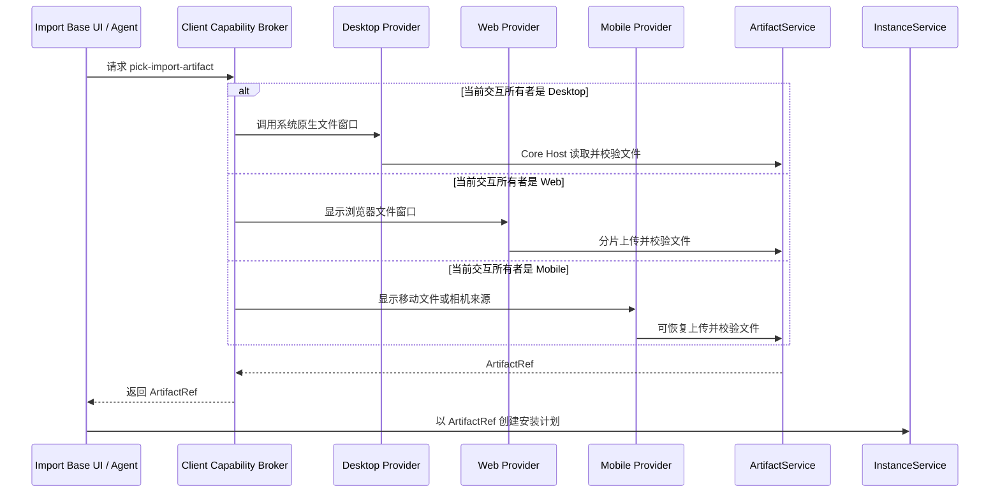

业务组件只接受 ArtifactRef，不接受来自 Client 的任意绝对路径。

需要选择 Core 所在机器上的目录时，Web 和 Mobile 使用 SeaShard 后端文件浏览器；Client 本地文件窗口只代表当前设备。

### 15.8 Agent 请求人工参与

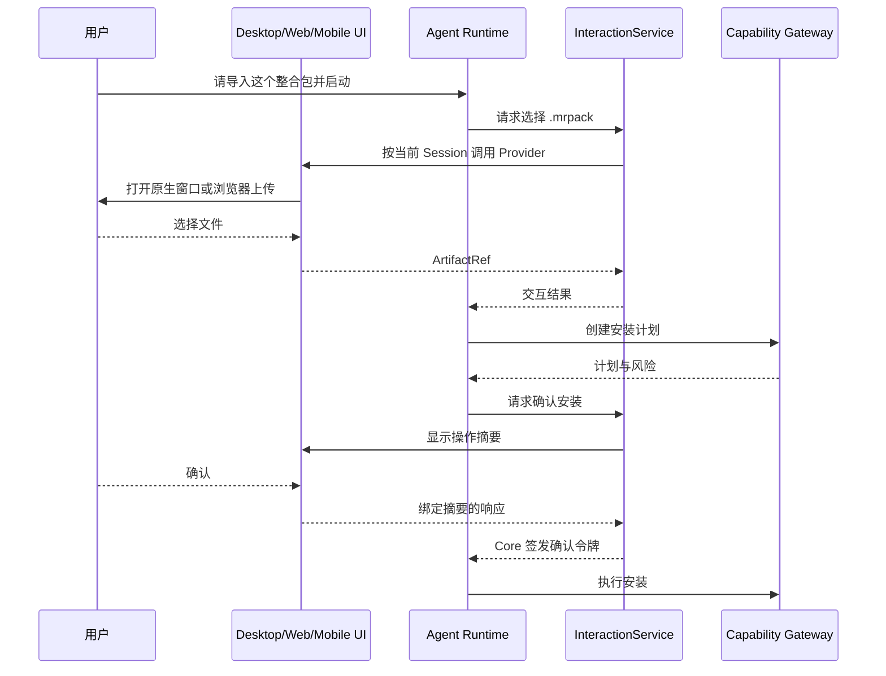

### 15.9 客户端结果不可信

- 文件必须由 ArtifactService 校验大小、格式和哈希；
- 确认必须绑定 Session、用户、Operation、参数摘要和 Nonce；
- Secret 输入直接写入 SecretService，Agent 只得到 SecretRef；
- Client 不能自行决定权限；
- 普通 UI 插件不能伪造用户批准结果。

## 16. 状态投影与原子订阅

Desktop IPC 和 WebSocket 使用相同状态协议：

```text
subscribe(projection, lastKnownRevision)
→ snapshot at revision R
→ ordered deltas after R
→ heartbeat
→ reconnect or resync
```

不能先取快照再单独订阅，否则会漏掉中间 Delta。握手流程：

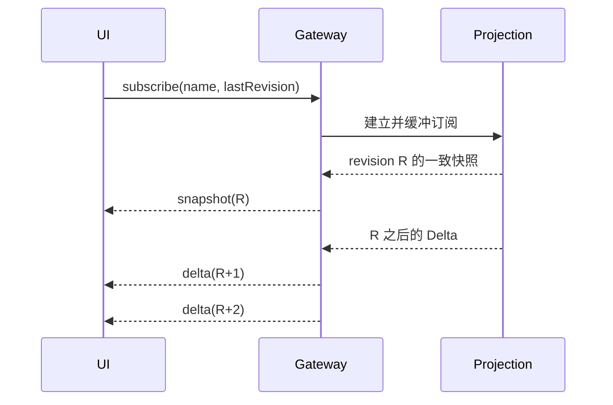

Revision 按 Projection Namespace 维护。窗口销毁或 Web Session 断开时，Gateway 按 Sender 或 Session 自动释放订阅。出现断号时按 Revision 补读有限 Delta Log；无法补读时重新请求快照。

Pinia 只保存：

- 当前页面和选择；
- 表单草稿；
- Main 投影；
- 加载和错误显示；
- 临时 UI 状态。

## 17. Service、Event、Policy Hook 与 Contribution

### 17.1 Service

用于请求一个能力完成一件事：

```text
InstanceService.resolve()
LaunchService.start()
BackupService.create()
ServerRuntimeService.stop()
```

Service 是领域能力，不是万能底层工具集合。

#### 返回值可选校验

领域组件可以在注册 Service Provider 时，为具体方法自愿声明返回值校验器。校验器附属于同一条 Service Registration，与 Provider 共享 `runtimeId`、Scope、generation、生命周期和注销操作，不注册成第二个公共 Service。

```ts
interface ServiceResultValidationIssue {
  readonly path?: readonly PropertyKey[];
  readonly message: string;
}

interface ServiceResultValidator {
  validate(
    value: unknown,
  ): Awaitable<readonly ServiceResultValidationIssue[]>;
}

ctx.provide(contract, provider, {
  resultValidators: {
    methodName: resultSchema,
  },
});
```

Service Registry 选中完整 Registration 并调用 Provider。对应方法声明校验器时，Runtime 在取得返回值后执行校验；失败错误携带 `runtimeId`、Contract、方法和问题列表，并归责声明组件。没有声明校验器时，Runtime 直接返回原值，不推测领域结构、不查找 Core 同名校验器，返回值错误及其后果由组件承担。

校验器只接受或拒绝返回值，不补默认值、不删除字段、不转换路径或 URL，也不修正组件输出。Schema 可以作为校验器的声明来源；Runtime 只使用其校验结果并继续返回组件原始值。Host 数据需要投影为 Client DTO 时，领域组件先完成显式 Client Projection，再返回并可选校验最终 DTO。

外部插件的校验器保留在其 Plugin Host 中，与 Provider 在同一进程和注册生命周期内执行，避免为校验增加第二次 IPC。无论组件是否声明领域校验器，平台仍统一强制 JSON 安全、传输大小与深度、权限、超时、取消和进程协议等通用边界；这些规则不解释领域字段。

Core、Gateway 与 Desktop 不为内置组件或第三方插件集中手写 `expectXxx()`。新增 Contract 不要求修改中央校验文件。

### 17.2 Event

Event 只通知已经发生的事实：

```text
instance.resolved
server.started
server.stopped
component.failed
```

事实通知使用显式分发模式：`emit` 用于同步观察，`parallel` 用于调用方需要等待全部观察者结束的异步观察。监听器不能改变已经提交的事实；Journal Commit 之后发出的 Event 即使有监听器失败，也不能回滚已提交 Event。关键流程不能只靠广播完成，需要返回值、授权和错误处理时使用 Service 或 Intent。

### 17.3 Policy Hook

Policy Hook 用于动作发生前的策略扩展、变换或拒绝，例如权限决策、Tool 执行策略和 LaunchManifest 校验。Hook 必须声明固定模式：

- `serial`：按顺序执行全部策略并聚合结果；
- `waterfall`：当前处理器可以委托下一处理器、变换结果或明确短路。

每个 Hook Contract 同时声明超时、错误传播和 fail-open/fail-closed；权限、Secret、付费和世界修改 Hook 必须 fail-closed。Event 不能冒充 Policy Hook，Policy Hook 也不能作为已发生事实的持久记录。

### 17.4 Contribution

用于向有限位置增加能力：

- UI 页面、区块和动作；
- Agent Tool 和 Context Source；
- Client Capability Provider；
- LaunchManifest Contribution；
- 日志解析器；
- 内容源；
- 服务端核心 Provider。

Contribution 进入语义明确且支持 Scope 的 Registry，不提供任意注入入口。

## 18. 已组件化能力与设计索引

根设计只保存跨组件架构、产品边界和长期不变量。Host 能力与内部模块的判断见 [components/DESIGN.md](components/DESIGN.md)；已落地 Host 组件和 Client Entry 的内部职责、依赖、生命周期、数据模型、失败处理、后续范围和验收规则，以对应 `components/` 或 `frontend/` 叶子目录为准。

### 18.1 当前组件设计

| 组件 | 类型 | 设计文档 |
|---|---|---|
| `seashard.database-sqlite` | 受保护 Bootstrap Component | [components/data/database-sqlite/DESIGN.md](components/data/database-sqlite/DESIGN.md) |
| `seashard.plugin-foundation` | 受保护 Bootstrap Component | [components/plugin/foundation/DESIGN.md](components/plugin/foundation/DESIGN.md) |
| `seashard.download` | 可重载内置 Host Entry | [components/network/download/DESIGN.md](components/network/download/DESIGN.md) |
| `seashard.server-core-source` | 可重载内置 Host Entry | [components/server/core-source/DESIGN.md](components/server/core-source/DESIGN.md) |
| `seashard.server-download-ui` | 可重载内置 Desktop Client Entry | [frontend/server/download/DESIGN.md](frontend/server/download/DESIGN.md) |
| `seashard.runtime-diagnostics` | 可重载内置 Host Entry | [components/diagnostics/runtime/DESIGN.md](components/diagnostics/runtime/DESIGN.md) |
| `seashard.runtime-diagnostics-ui` | 可重载内置 Desktop Client Entry | [frontend/diagnostics/runtime/src/index.ts](frontend/diagnostics/runtime/src/index.ts) |
| `seashard.desktop-shell` | 可重载内置 Electron Host Entry | [components/desktop/shell/DESIGN.md](components/desktop/shell/DESIGN.md) |
| `seashard.personalization-ui` | 可重载内置 Desktop Client Entry | [frontend/settings/personalization/DESIGN.md](frontend/settings/personalization/DESIGN.md) |
| `seashard.about-ui` | 可重载内置 Desktop Client Entry | [frontend/settings/about/DESIGN.md](frontend/settings/about/DESIGN.md) |

根 `DESIGN.md`、`components/DESIGN.md` 和现有叶子设计文档都属于本地架构笔记，均由 `.gitignore` 的 `DESIGN.md` 规则排除，不进入 Git。

### 18.2 跨组件公共规则

- 平台组件不理解具体页面、Minecraft、服务器或 Agent 业务；
- 依赖通过类型化 Service Contract 和 `inject/provides` 表达，不依赖隐含注册顺序；
- 组件拥有自己创建的 Worker、窗口、IPC Handler、Repository 和其他副作用，并由 Cordis 生命周期逆序释放；
- 领域组件只依赖稳定 Contract，不取得 Electron Handle、SQLite Connection、Cordis 内部对象或其他组件的可变实现状态；
- `frontend/` 只承载 Client Entry、页面、视图模型和临时交互状态；不得直接取得 SQLite、文件系统、CNB 或其他 Host 权威状态，只能消费类型化 Client Service 与投影；
- 受保护 Bootstrap Component 与普通可重载 Entry 使用不同启动层级，但遵循相同的依赖声明和资源归属原则；
- 新组件目录创建后必须在自身 `DESIGN.md` 记录设计，根文档只增加索引，不复制实现细节。

### 18.3 后续公共平台能力

公共下载的首个纵切已经由 `seashard.download` 落地。后续仍按真实纵切增加 Config、Migration Coordinator、Secret、File、Proxy/Network Policy、Artifact、Task、Journal、Projection、Process、Java、Permission、Notification、完整 DiagnosticService、完整 WindowService、ClientSessionRegistry 和 ClientCapabilityBroker；没有实现时不创建空组件目录。

## 19. Minecraft 领域组件

### 19.1 客户端与实例

- `instance-catalog`：实例列表、导入和元数据；
- `version-resolver`：Minecraft、Loader、Library 和 Asset 解析；
- `instance-installer`：按解析计划落盘；
- `content-manager`：Mod、资源包、光影、数据包和整合包；
- `account-service`：账户引用与登录状态；
- `launch-planner`：收集贡献并生成 LaunchManifest；
- `client-runtime`：拥有客户端进程的期望生命周期。

### 19.2 服务端

- `server-core-source`（已实现）：当前从 CNB 提供经过来源和 SHA-256 校验的服务端核心目录，缓存到核心 SQLite，并把制品传输委托给公共下载组件；它不拥有服务端实例目录、部署计划或运行进程；
- `server-catalog`：服务端配置和目录；
- `server-provisioner`：生成并执行部署计划；
- `server-runtime`：拥有服务端进程的期望生命周期；
- `server-config`：结构化配置和差异；
- `server-content`：服务端 Mod 与插件；
- `backup-service`：备份、校验、保留策略和恢复；
- `server-diagnostics`：崩溃、日志、性能和兼容性分析。

### 19.3 自动化

- `scheduler`：时间触发；
- `workflow`：组合领域 Service；
- `maintenance-policy`：备份、升级、重启和告警策略。

自动化不能绕过 ExecutionContext、Capability Gateway 和 Journal。

## 20. Operation Journal

### 20.1 两条规则

> Process-visible means journaled：最终影响进程启动内容的决定必须记录。

> World-mutating means journaled：改变服务器、世界、实例、配置、内容或权限的操作必须记录。

### 20.2 Stream

```text
instance/<instanceId>
server/<serverId>
task/<taskId>
component/<componentId>
audit/<scopeId>
interaction/<interactionId>
```

Agent 对话不进入 Operation Journal。Agent 触发的真实操作进入对应 Instance、Server、Task 或 Audit Stream，并携带 Agent 关联字段。

每条 Event 包含：

```text
eventId
globalPosition
streamId
seq
expectedSeq
type
timestamp
actor
principal
operationId
correlationId
causationId
agentSessionId
turnId
toolCallId
payload
schemaVersion
```

`seq` 在 Stream 内单调递增；`globalPosition` 用于跨 Stream 投影游标；`expectedSeq` 用于乐观并发。

### 20.3 Intent、Outcome 与无法确定的结果

```mermaid
flowchart LR
    REQUEST[请求] --> INTENT[Intent 已持久化]
    INTENT --> EXECUTE[执行外部副作用]
    EXECUTE --> COMMIT[Committed]
    EXECUTE --> FAIL[Failed]
    EXECUTE --> PARTIAL[PartiallyApplied]
    EXECUTE --> UNKNOWN[Unknown]
    UNKNOWN --> RECONCILE[Reconciled]
    UNKNOWN --> HUMAN[RequiresAttention]
```

每种 Operation 必须声明 Reconciliation Policy：

- 可探测：读取文件或进程状态自动核对；
- 可幂等重试：依赖明确幂等键；
- 可能部分应用：记录已完成部分；
- 无法确定：进入 `RequiresAttention`，等待人工裁决。

`Failed` 不等于没有产生任何副作用。发送控制台命令、远程请求和世界恢复等操作不能假装总能自动判断或回滚。

### 20.4 投影与遥测

由 Journal 投影得到：

- 当前实例和服务器状态；
- 任务关键状态；
- 配置版本；
- 权限与组件状态；
- 操作历史和等待交互。

以下内容进入独立实时或日志存储：

- 高频控制台输出；
- 性能指标；
- 下载字节级进度；
- 鼠标、焦点和普通页面状态。

关键摘要可以以 ArtifactRef 被 Journal 引用。

### 20.5 事务规则

- Event 与必要投影更新在一个 DatabaseService 事务中完成；
- 历史 Event 不原地修改；
- 投影保存 `asOfGlobalPosition`；
- 大内容保存到 ArtifactService；
- Schema Version 与迁移保持可追踪；
- Operation Intent 在外部副作用之前提交。

## 21. 持久任务系统

任务关键状态事件是唯一事实。任务表只是可从 Journal 重建的运行投影，不能成为第二套真实状态。

```mermaid
flowchart TD
    COMMAND[创建或推进任务]
    TX[数据库事务]
    EVENT[追加 Task Event]
    PROJECTION[更新 Task Projection]
    RUNNER[Task Runner 执行]
    PROGRESS[高频 Progress Store]

    COMMAND --> TX
    TX --> EVENT
    TX --> PROJECTION
    PROJECTION --> RUNNER
    RUNNER --> PROGRESS
    RUNNER --> TX
```

任务状态：

```text
queued
running
waiting-user
waiting-client
succeeded
failed
cancelled
interrupted
requires-attention
```

Task Projection 包含：

```text
taskId
type
owner
scope
state
operationId
executorComponentId
executorGeneration
payloadSchemaVersion
checkpointSchemaVersion
createdAt
updatedAt
cancelPolicy
resumePolicy
resultRef
error
```

规则：

- 任务属于 Core，不属于窗口；
- UI 和 Agent 观察同一投影；
- 关键状态转换进入 Journal；
- 高频进度单独保存；
- 取消由任务定义语义；
- 重启后按 Resume Policy 恢复、核对或标记中断；
- 幂等键避免重复创建相同任务；
- 创建持久任务的 Provider 在任务落盘后可以释放短期调用租约；
- 插件升级必须迁移任务 Payload 和 Checkpoint，或拒绝卸载旧 generation。

## 22. LaunchManifest 与 SpawnPlan

LaunchManifest 是“准备启动什么”的不可变描述。ProcessService 只接受 `manifestId + manifestHash`，不接受调用者另外传入 argv、cwd 或 env。

包含：

- 目标实例或服务端；
- Minecraft、Loader、服务端核心版本；
- Java 路径和版本；
- 工作目录；
- JVM 与游戏参数；
- 环境变量键和 SecretRef；
- Classpath 与 Native 路径；
- 内存和启动模式；
- 关键 Library、Mod、插件和配置哈希；
- 每个组件贡献；
- 配置 Revision、策略和 Manifest Hash。

```mermaid
flowchart TD
    CONTRIBUTIONS[收集组件贡献]
    VALIDATE[校验冲突和必需项]
    MANIFEST[生成并持久化 LaunchManifest]
    LEASE[取得实例内容读租约]
    RECHECK[启动边界复核文件哈希]
    PLAN[ProcessService 生成 Canonical SpawnPlan]
    SECRET[内部解析 SecretRef]
    INTENT[持久化 Launch Intent 与进程记录]
    SPAWN[执行 Spawn]

    CONTRIBUTIONS --> VALIDATE
    VALIDATE --> MANIFEST
    MANIFEST --> LEASE
    LEASE --> RECHECK
    RECHECK --> PLAN
    PLAN --> SECRET
    SECRET --> INTENT
    INTENT --> SPAWN
```

生成到 Spawn 之间必须持有实例内容读租约，或使用不可变内容快照。无法取得租约时在 Spawn 边界重新校验关键文件，变化即中止并重新生成 Manifest。

Canonical SpawnPlan 由 ProcessService 从 Manifest 确定性生成。比较非密钥字段、环境变量键和 SecretRef 身份，不记录 Secret 明文。

## 23. JVM 进程所有权

旧设计让 ProcessService、TaskService 和 Runtime 都像进程拥有者。本版明确区分。

| 对象 | 唯一责任 |
|---|---|
| ClientRuntime / ServerRuntime | 进程期望生命周期和领域状态 |
| ProcessService | OS 句柄、Spawn、Signal、等待和低层观察机制 |
| TaskService | 启停工作记录与进度，不拥有 JVM |
| JournalService | 记录 Intent、进程事实和核对结果 |

```mermaid
flowchart LR
    RUNTIME[Client/Server Runtime\n期望生命周期]
    TASK[Task Service\n工作记录]
    PROCESS[Process Service\nOS 句柄]
    JVM[JVM Process]
    JOURNAL[Operation Journal]

    TASK --> RUNTIME
    RUNTIME --> PROCESS
    PROCESS --> JVM
    RUNTIME --> JOURNAL
    PROCESS --> JOURNAL
```

每次 Spawn 记录：

```text
manifestId
manifestHash
pid
osCreationTime
executableHash
commandDigest
randomHandshakeId
runtimeId
startedAt
```

不能只凭 PID 收养进程，因为 PID 会复用。

首版策略：

- Minecraft 客户端：Main 正常退出时请求客户端停止或允许用户明确选择保留；异常退出后默认标记为外部存活进程，不承诺恢复控制台；
- Minecraft 服务端：由专用 Server Supervisor 子进程承载，以便 Electron Window 或 Main 重启后重新连接日志和控制通道；
- 组件卸载：有活动进程时完成明确交接，无法交接则拒绝卸载；
- 外部进程核对失败时进入 `requires-attention`，不能误杀只因 PID 相同的其他进程。

Server Supervisor 属于官方受控执行组件，不等同于普通第三方插件进程。

## 24. 原生 Agent Plane

Agent 是默认启用的内置插件包，不是 Kernel 特权路径。

```text
components/agent/
├─ runtime
├─ session
├─ model-provider
├─ context
├─ tools
├─ policy
├─ interaction
└─ ui
```

### 24.1 Agent Runtime

负责：

- 会话状态机；
- 模型请求和流式输出；
- Context 组装与压缩；
- Tool Call 调度和 Result 回填；
- 中断、取消和恢复；
- 通过 InteractionService 请求人工参与。

不直接实现 Minecraft 业务，不直接访问文件、进程、Shell、IPC 或 Secret。

### 24.2 Tool Definition、Provider 与 Consumer

每个 Tool 明确声明：

```text
name
version
inputSchema
outputSchema
requiredCapabilities
scopeType
risk
idempotency
retryPolicy
timeout
cancellation
confirmationPolicy
secretPolicy
resultRenderer
```

Service 不通过反射自动成为 Tool。Tool 是领域 Service 的薄适配器，不保存业务状态。

### 24.3 Tool 快照与 Provider 租约

模型每一轮冻结：

- Tool Definition；
- Context 结果；
- 精确 Provider generation；
- 权限范围；
- 工具集合摘要。

快照只冻结模型可见内容，不保证 Provider 永远存在。调度时对准确 generation 原子 `tryAcquire`：

```mermaid
flowchart TD
    SNAPSHOT[冻结 Tool 与 Provider Generation]
    ACQUIRE[原子 tryAcquire]
    RUN[执行 Tool]
    RELEASE[释放租约]
    QUIESCE[组件进入 quiescing]
    REMOVE[从 Registry 撤下]
    WAIT[等待已有租约]

    SNAPSHOT --> ACQUIRE
    ACQUIRE -->|成功| RUN
    RUN --> RELEASE
    QUIESCE --> REMOVE
    REMOVE --> WAIT
    RELEASE --> WAIT
```

停止组件时先进入 `quiescing`、撤下 Provider、拒绝新租约，再等待已有租约协作取消。超时只能拒绝卸载或升级为 `restart-host/restart-app`，不能边执行边释放 Context。

Tool 创建持久任务后释放短期租约；任务记录 executor component、generation 和 Schema Version，由升级协议迁移或拒绝卸载。

### 24.4 基础组合与动态 Overlay

Agent Session 的可见能力由作用域内的基础组件组合与可选动态 Overlay 共同组成。基础组合通过正常 Plugin Binding 和 Supervisor 管理；动态 Overlay 允许已获明确授权的 Agent 在自己的 Session Scope 中定义、启动、停止和删除临时组件，从而在后续轮次增加或移除 Tool、Context Source、Policy Hook 和临时 UI Contribution。

动态 Overlay 不是正式插件安装或升级：

- 只接受 ESM JavaScript，不在运行时编译 TypeScript/Vue，也不调用任何包管理器；
- 每个 Overlay 是独立 Runtime Unit，绑定 `agentSessionId`、overlay revision、generation 和清理栈；
- 不能替换 Journal、Permission、Secret、Supervisor 和其他受保护权威组件，也不能扩大当前 ExecutionContext；
- 变更最早从下一轮模型请求生效；当前轮冻结的 Tool、Context、Policy 和 Provider generation 保持不变；
- 已开始的 Tool Call 继续持有准确 generation，持久 Task 继续使用已记录的 Executor generation；
- Session Log 记录 Overlay ID、代码摘要、revision、启停事实和最终模型可见 Schema；默认不在重启后自动恢复代码，恢复会话时明确显示为 unavailable；
- 需要持久化或跨 Session 使用时，必须由用户通过正常开发、预构建、校验和 PluginInstaller 流程提升为正式插件包。

Agent 生成并执行代码的信任等级等同于授予 Shell 或加载完全信任插件。第一版只能在用户明确授权该能力后进入独立 Node Plugin Host；该进程不是不可信代码沙箱，不能把 Context façade 或 VM 包装宣传成安全边界。

### 24.5 Agent Context

组件可以贡献：

- 当前实例或服务器；
- LaunchManifest；
- 组件图和失败；
- Java、Loader 和服务端版本；
- 崩溃摘要；
- 配置差异；
- 任务和权限；
- 当前 Client Session 能提供的交互能力。

完整日志、世界目录和大量 Mod 文本不直接进入 Prompt。Agent 使用有界查询 Tool，返回摘要和 ArtifactRef。

### 24.6 Agent Session Log

记录：

- 用户与 Assistant 消息；
- 最终系统 Prompt；
- 模型和参数；
- Context；
- Tool Definition；
- Tool Call 与 Tool Result；
- 压缩和恢复事件。

> Model-visible means session-logged。

Agent Session Log 与 Operation Journal 通过以下字段关联：

```text
agentSessionId
turnId
toolCallId
executionId
operationId
correlationId
principal
```

Agent Session 不作为 Operation Journal Stream。需要查询某会话做过什么时，根据以上字段建立可重建索引。

### 24.7 Tool 执行顺序

```mermaid
sequenceDiagram
    participant Agent
    participant Session as Agent Session Log
    participant Gate as Capability Gateway
    participant Journal as Operation Journal
    participant Service as Domain Service

    Agent->>Session: 记录 Tool Call
    Agent->>Gate: Tool Input + ExecutionContext
    Gate->>Journal: 事务写入 Intent 与消费确认令牌
    Journal-->>Gate: Intent Committed
    Gate->>Service: 执行领域能力
    Service->>Journal: 写入 Outcome
    Service-->>Agent: 结构化结果
    Agent->>Session: 记录 Tool Result
```

崩溃恢复：

- 有 Tool Call、无 Intent：未开始；
- 有 Intent、无 Outcome：按 Reconciliation Policy 核对；
- 有 Outcome、无 Tool Result：从 Journal 恢复结果或引用；
- Unknown 或 PartiallyApplied：进入核对或人工裁决；
- Tool Result 已写入：按正常会话继续。

### 24.8 自主模式

| 模式 | 权限行为 |
|---|---|
| 诊断 | 只读取状态、日志、配置、崩溃和依赖 |
| 辅助 | 可以制定方案，写操作需要用户确认 |
| 托管 | 只在预先授予的资源和能力范围内自主运行 |

三个模式是 Permission Policy，不产生三套 Agent 实现。

### 24.9 Model Provider 与商业 API

Agent Runtime 只依赖统一 `ModelProvider` Contract，不直接拼接某个厂商 URL。首批组件：

| 组件 | 行为 |
|---|---|
| ModelProviderRegistry | 注册 Provider、模型、能力、健康状态和选择策略 |
| ManagedModelProvider | 调用 SeaShard 商业团队的固定 API Gateway |
| CustomOpenAICompatibleProvider | 调用用户配置的 OpenAI-compatible Endpoint |

Provider 至少暴露：

```text
listModels()
getCapabilities(model)
createResponse(request)
streamResponse(request)
cancel(requestId)
health()
normalizeUsage(result)
```

模型能力显式协商 Tool Calling、Structured Output、Vision、Files、Streaming、Context Limit 和 Usage，不根据模型名称猜测。

托管商业 API：

- 应用内置固定 Origin 和协议版本，不内置团队的上游模型 API Key；
- Desktop 和 Mobile 通过系统浏览器执行 OAuth Authorization Code + PKCE，会员权益由服务端判断；
- ManagedModelProvider 使用短期、受 Audience 限制的 Access Token 调用团队 API Gateway；
- Gateway 负责 Entitlement、套餐限额、计量、限速、审计和上游模型路由；
- Hosted Core 使用自己的短期 Workload Identity 换取 Tenant Scope 模型权限，不复制 Desktop Refresh Token；
- Agent Session Log 记录 Provider、Model、Usage 和 Request ID，但不记录 Access Token、上游 Key 或用户 BYOK。

用户自定义 API：

```text
providerId
protocol
baseUrl
modelId
authSecretRef
allowedHeaders
executionLocation
tlsPolicy
capabilityOverrides
```

首版只支持明确版本的 OpenAI-compatible 协议，不接受任意脚本适配。API Key 和自定义 Header Value 进入 SecretService；Renderer、插件和 Agent 只看到 SecretRef。

`executionLocation` 必须明确：

- `local-host`：由用户自己的 Core 发起请求，用户自行决定是否连接 localhost、局域网模型、自托管服务或公网供应商；
- `hosted-cloud`：允许用户填写任意 HTTP/HTTPS Endpoint，不维护供应商白名单，也不要求 SeaShard 审核上游；HTTP、无效证书或其他弱 TLS 配置需要明确风险提示，由用户决定是否继续；
- 本地可用的 URL 不自动复制到 Hosted Core；用户若要远程 BYOK，必须单独授权并安全保存于远程 Secret Store；
- 需要访问用户私网的 Hosted Endpoint 通过绑定到该 Tenant 的专用 Tunnel、Private Connector 或私网路由实现。

责任边界：

| 风险 | 责任方 |
|---|---|
| 上游供应商读取 Prompt、文件、API Key 或返回恶意内容 | 用户选择并信任供应商，SeaShard 做明确提示和审计 |
| 上游不可用、限速、乱计费、协议不兼容或模型质量问题 | 用户与上游供应商 |
| Hosted Workload 借自定义 URL 访问 SeaShard Control Plane、云 Metadata、Node 管理面或其他 Tenant | SeaShard 商业平台 |
| SeaShard 把一个 Tenant 的 Secret、Artifact 或网络权限泄漏给另一个 Tenant | SeaShard 商业平台 |

因此 Hosted Core 不审查“这个上游是否值得信任”，但模型请求从 Tenant 隔离的 Egress Connector 发出。该 Connector 默认没有通往 Control Plane、云 Metadata、宿主 Node 和其他 Tenant 网络的路由；Redirect 和 DNS 变化仍受同一网络隔离。这里限制的是 SeaShard 自己的基础设施暴露面，不限制用户选择哪家上游。

参考：[OAuth for Native Apps](https://www.rfc-editor.org/rfc/rfc8252) · [OAuth Security BCP](https://www.rfc-editor.org/rfc/rfc9700) · [OWASP SSRF Prevention](https://cheatsheetseries.owasp.org/cheatsheets/Server_Side_Request_Forgery_Prevention_Cheat_Sheet.html)

## 25. Capability Gateway 与权限

每次能力调用携带 ExecutionContext，并按以下内容授权：

```text
principal
capability
resourceScope
normalizedArgumentsDigest
clientSessionId
agentSessionId
taskId
requestId
correlationId
operationId
confirmationToken
```

Principal 至少包括：

- 当前用户；
- Client Session；
- Agent Session；
- 自动化任务；
- 内置组件；
- 隔离插件进程。

Agent 不能替用户给自己授权。允许重启 `server-a` 不等于允许操作所有服务器。

能力示例：

```text
instance.read
instance.modify
artifact.upload
artifact.download
process.launch
server.read
server.control
world.modify
world.restore
component.manage
database.integrated
client.interaction.request
secret.use
```

`database.integrated` 是保留能力名，当前第三方 SDK 和安装流程尚未开放。

权限策略位于 Core，不位于 Prompt、UI 或插件 Manifest 的自我声明中。

## 26. 配置、Secret 与文件

### 26.1 配置

- 配置按组件拥有；
- 组件提供 Schema、默认值和迁移函数；
- 更新采用校验后的新版本；
- 每次关键配置更新有 Revision；
- 影响启动的配置进入 LaunchManifest；
- 影响外部状态的配置操作进入 Journal；
- UI 只编辑草稿，Core 校验并提交。

### 26.2 Secret

- 模型 Key、账户令牌和远程凭据由 SecretService 保存；
- 其他组件只获得有范围的使用能力或 SecretRef；
- 不通过 IPC、HTTP 返回明文；
- 不写入普通日志、Agent Session、Journal 或崩溃包；
- 诊断包统一脱敏。

### 26.3 文件

- 关键文件使用临时文件、校验和原子替换；
- 下载内容按哈希缓存；
- 解压前检查路径穿越和大小上限；
- 文件访问受 ExecutionContext 的 Workspace、Instance 或 Server Scope 限制；
- 备份恢复先验证目标、空间、清单和哈希；
- Web 上传先进入 ArtifactService，不能直接写目标实例目录。

## 27. 安全边界

### 27.1 Agent

- 不提供任意 Shell Tool；
- 不提供任意路径文件 Tool；
- 不提供通用 IPC 或 HTTP Tool；
- Prompt、日志、聊天和网页不能修改权限；
- 网络请求受域名、用途、大小和权限限制；
- Secret 只通过 SecretRef 使用。

### 27.2 Desktop Renderer

Desktop Renderer、BrowserWindow 和 IPC 的实现安全边界不在根文档重复，见：

- [Desktop Shell：Renderer 与 IPC 安全边界](components/desktop/shell/DESIGN.md#7-renderer-与-ipc-安全边界)
- [§12.3 Preload](#123-preload)

### 27.3 Web UI

- 默认只绑定 localhost；
- 远程访问显式开启；
- 使用 Auth、Session、Origin、CSRF 和 WebSocket 鉴权；
- 上传和下载使用 Artifact 临时令牌；
- 不向浏览器返回任意绝对路径和 Secret；
- Client Capability Result 始终由 Core 再校验。

### 27.4 Mobile Client

- Mobile 是 Client Only，安装包和 Web Bundle 不包含 Core、JVM、Plugin Host 和 ProcessService；
- 设备配对、角色和撤销由 Core 管理；
- Credential 保存在平台安全存储或受保护浏览器存储，不使用普通 Local Storage 保存长期高权限 Token；
- 进入后台或断线后 Client Capability Lease 失效；
- 生物识别不能代替 Core 授权，只用于解锁设备密钥和签署绑定 Operation Digest 的响应；
- Mobile 返回的文件、确认、相机和通知结果都由 Core 再校验；
- 移动端不获得 `core.domain.process.*`、`node.execution.*` 和 Host 管理能力。

### 27.5 插件进程

- 第一版允许内置、官方和用户明确完全信任的外部插件运行在独立 Node Plugin Host；这些插件可能读取用户文件、联网或启动程序，独立进程不是安全沙箱；
- 安装、升级和重新授权界面必须明确展示来源、版本、内容摘要、运行位置和权限变化，不能把 Manifest 权限伪装成系统级隔离；
- 外部插件不能直接进入 Electron Main，也不能通过声明能力冒充 Core 权威 Service；
- Host 崩溃不拖垮 Main，Core 负责回收 Provider Lease、调用和任务状态；
- 未经用户完全信任的插件第一版不加载；未来公开生态必须先完成受限 Runtime、资源上限、逃逸验证、审核和准入机制。

### 27.6 商业 Control Plane

- Electron 和原生 Mobile 是 OAuth Public Client，不保存所谓“客户端密钥”；登录使用系统浏览器、Authorization Code + PKCE 和精确 Redirect URI；
- Control Plane Access Token 短期、受 Audience 和 Scope 限制；Refresh Token 轮换并可按设备撤销；
- 会员 Entitlement 只表示可以申请某套餐，不等于拥有任意 Deployment Capability；
- 价格确认和高风险远程操作使用绑定精确 Operation Digest 的一次性 Grant；
- Desktop、Mobile、Agent 和 ManagedDeploymentProvider 永远不获得 Kubernetes、Docker、云账户或 Provisioner 管理凭据；
- Hosted Workload 使用可轮换的短期 Workload Identity，不使用共享静态 Secret；
- Tenant 间默认网络拒绝、存储隔离、资源配额和审计是上线条件；
- 远程 Artifact、日志和备份下载使用短期、有资源 Scope 的 URL 或 Session；
- 会员到期与数据删除分离；删除前必须满足公开保留策略、通知、导出窗口和可审计状态转换。

## 28. 诊断与可观察性

DiagnosticService 提供：

- 插件包和 Runtime Unit 图；
- Cordis 实际状态和 Supervisor 期望状态；
- 缺失依赖与依赖环；
- Provider generation 和活跃租约；
- UI Base/Desktop/Web/Mobile 入口状态；
- Client Session 与 Capability Provider 租约；
- 等待交互和交互所有者；
- 当前任务、操作和 Reconciliation 状态；
- Main、Renderer、插件进程、Server Supervisor 和 JVM 状态；
- 配置 Revision、LaunchManifest 和 Journal Position；
- IPC、HTTP 和 WebSocket 调用关联；
- 最近崩溃和恢复结果。

当前最小运行态投影和 Desktop IPC 适配分别见 [Runtime Diagnostics](components/diagnostics/runtime/DESIGN.md) 与 [Desktop Shell](components/desktop/shell/DESIGN.md)。本节只描述完整 DiagnosticService 的跨系统目标。

日志字段：

```text
timestamp
level
componentId
runtimeId
generation
principal
clientSessionId
requestId
correlationId
operationId
taskId
interactionId
message
fields
```

高频 Minecraft 控制台进入专用存储，按时间、级别和来源查询。Agent 默认读取有界窗口和摘要。

## 29. 故障与恢复

### 29.1 组件失败

- 非关键组件失败不拖垮整个应用；
- 失败入口保留结构化原因；
- 依赖它的入口进入 `waiting` 或停止；
- 自动重试只用于明确可重试并带退避的错误；
- 配置错误、权限拒绝和不兼容版本不无限重试。

### 29.2 Main 重启

恢复顺序遵循两段式启动：

1. 取得 DataRoot Lease，由 Bootstrap Loader 启动受保护基础设施组件；当前组件与详细启动关系见 [§18.1](#181-当前组件设计)；
2. 恢复期望状态、Migration Operation、Outbox 和所有权威投影；
3. 创建普通 ComponentSupervisor；
4. 核对文件、JVM、Server Supervisor 和遗留插件进程；
5. 恢复、核对或标记持久任务；
6. 解析并启动普通可重载组件；
7. 恢复 Agent Session；
8. 恢复 Electron/Web Gateway；
9. Client 重连后重新注册临时能力。

不通过重放历史命令恢复外部状态。

### 29.3 UI 重启或断线

- UI 使用原子快照订阅恢复投影；
- Client Session 断开后 Provider Lease 失效；
- 等待交互进入 `requires-handoff` 或等待重连；
- Main 中的服务器、任务和 Agent Session 继续运行；
- 旧 Provider generation 的迟到结果被拒绝。

### 29.4 插件升级

```text
下载并验证新版本
→ 检查作用范围、依赖和权限变化
→ 创建独立 candidate generation 与 Reconcile Operation
→ 模块、Config Schema 和依赖准备成功
→ hot-swap：启动未发布候选 → 原子发布 → 排空并停止旧 generation
→ stop-first：撤下并停止旧 generation → 启动并发布候选
→ 候选启动失败：hot-swap 保留旧发布者；stop-first 重新创建上一规格
→ 每次发布都推进 epoch，旧 generation 不再获得新租约
```

插件作者直接通过 `upgradeMode` 承诺 Entry 的并存能力，Supervisor 不猜测资源语义。`hot-swap` 追求无空窗切换，但错误声明可能造成新旧实例争用外部资源；`stop-first` 接受短暂停机以保护独占资源。Generation、Publication 和 Operation 分表持久化；Main 重启时旧 Publication 失效，未完成 Operation 标记为 interrupted，再按 Binding 意图重新协调，而不是重放历史副作用命令。

## 30. 当前目录结构

当前基础设施目录如下；各组件设计见 [§18.1](#181-当前组件设计)，未实现的产品域不预建空目录：

```text
SeaShard/
├─ apps/
│  ├─ desktop/
│  │  ├─ src/main/
│  │  ├─ src/preload/
│  │  └─ src/renderer/
│  ├─ database-worker/
│  └─ plugin-host/
├─ packages/
│  ├─ bootstrap-runtime/
│  ├─ component-supervisor/
│  ├─ contracts/
│  ├─ database/
│  ├─ plugin-sdk/
│  └─ plugin-system/
└─ components/
   ├─ DESIGN.md                      # 独立组件与内部模块判断标准
   ├─ data/
   │  └─ database-sqlite/
   ├─ desktop/
   │  └─ shell/
   ├─ diagnostics/
   │  └─ runtime/
   └─ plugin/
      └─ foundation/
```

后续按真实能力增加 `minecraft`、`agent`、`client`、`deployment` 等能力域；没有实现时不创建空目录。Bootstrap Foundation 使用 `packages/bootstrap-runtime` 加受保护 Component Descriptor，不建立一个继续吸收所有底层能力的 `bootstrap-core` 万能组件。

单个功能插件包：

```text
components/minecraft/server-management/
├─ plugin.json
└─ src/
   ├─ shared/
   ├─ host/
   │  └─ index.ts
   └─ client/
      └─ index.ts
```

没有对应能力时不创建空目录。Windows、macOS 和 Linux 的平台 Provider 位于 `components/platform`；Mobile Client 组件位于 `components/mobile`。Docker Host Profile 的平台 Provider 位于 `components/docker`，镜像和 Compose 入口位于 `deploy/docker`；商业客户端适配器可以随应用发布或作为官方签名插件交付，商业 Control Plane、Provisioner 和运营基础设施位于独立服务仓库。领域组件不能出现具体操作系统、容器路径、Kubernetes 或 Docker 管理 API 调用。

## 31. 测试与验收重点

### 31.1 Cordis 与 Supervisor

- 只有 Cordis 拥有进程内生命周期和清理栈；
- Supervisor 期望状态与 Cordis 实际转换一致；
- 启停失败没有二次清理和状态分叉；
- 两段式启动可以在空数据库、旧数据库和损坏投影下给出明确结果。

### 31.2 插件包

- 一个包只有在跨 Host/Client 边界或需要独立生命周期时才拆多个通用 Entry，各 Entry 独立启停；
- Host Entry 通过同一 `apply(ctx, config)` 契约注册 Service、Event、Policy Hook、Provider 和 Agent Tool，Client Entry 按 Desktop/Web/Mobile Target 注册 UI Contribution；
- `inject` 声明的必需依赖缺失时，候选保持 prepared 且 Operation 标记 wait-dependencies；Config Schema 在 `apply` 前拒绝无效配置，卸载后所有 Context 注册和自有资源都被释放；
- 包版本只安装一次；global、workspace、server、agent 和 client-session Binding 分别产生 generation 与 Publication Slot，禁用窄 Scope 不影响其他 Binding；
- 近层 Binding 只覆盖声明支持 Scope 的贡献，不能替换全局受保护组件，也不能扩大 ExecutionContext 权限；
- 正式包只包含预构建 ESM JavaScript；安装和启动路径不执行 npm/pnpm/yarn/bun、构建脚本或生命周期脚本；
- Native Runtime Unit 只在 Manifest 声明的 `os + arch + ABI` 上激活，用户机器不现场编译 Native Addon；
- `hot-swap` 在私有未发布视图启动候选并原子切换，`stop-first` 在旧 generation 完整停止后启动候选；两者都保证只有一个 generation 对外发布；
- 本地开发目录与正式插件包使用同一 Entry Module Contract，最终 Entry Tree 可以显示来源层、Scope Binding、运行位置、依赖、权限和覆盖关系；
- 可以从应用仓库之外的本地目录或 `*.seashard-plugin` 文件安装用户完全信任的第三方插件，并通过与内置组件相同的 SDK 注册能力；
- 未签名插件只有在用户看到本机代码执行风险并明确确认后才加载，升级、作用范围或权限扩大时重新确认；
- 外部插件不能进入 Electron Main；Node Plugin Host 的隔离不能被测试或 UI 描述成安全沙箱。

### 31.3 UI

- Desktop 加载 Base + Desktop，Web 加载 Base + Web，Mobile 加载 Base + Mobile；
- UI 入口卸载后路由、槽位和订阅全部释放；
- Renderer 或 PWA 重载后恢复同一投影；
- 快照与 Delta 握手不漏事件；
- 单个 UI 组件错误不破坏 Shell；
- 在 Windows、macOS、Linux Electron 和真实移动浏览器中验证 CMZ、文件选择、状态同步与断线恢复；
- Mobile Bundle 不包含 Core、JVM、ProcessService 或 Plugin Host，也不能调用 Host 级 Contract。

### 31.4 Client Capability

- Provider 注册绑定 Session 和 generation；
- 断线后 Lease 自动失效；
- 多 Client 时只向交互所有者发送敏感请求；
- Handoff 后旧结果失效；
- Client 不能注册 Core 权威能力；
- 文件、确认和 Secret 结果由 Core 再校验。

### 31.5 权限

- ExecutionContext 只能由 Main 签发；
- 下游调用传播同一个 Context；
- 一次性确认不能重用或更换参数；
- 确认消费与 Intent 在同一事务；
- Agent、UI 和插件不能扩大资源 Scope。
- 插件装载授权只决定权限上限，实际调用必须携带仍有效的 Capability Lease；
- 换目标、换参数、过期、撤销、permissionRevision 或 generation 变化时旧 Lease 被拒绝；
- 付费和高风险操作的 Operation Grant 不能重放、换 Audience 或替换 Quote Digest。

### 31.6 Journal 与任务

- Intent 提交前不执行副作用；
- Unknown、PartiallyApplied 和 RequiresAttention 可表达；
- Task Event 是唯一真相；
- Task Projection 可以重建；
- Global Position 和 Expected Seq 正确；
- 高频遥测不进入 Journal。

### 31.7 Launch 与进程

- ProcessService 只接受 Manifest ID 和 Hash；
- Manifest 到 Spawn 期间文件变化会中止启动；
- SpawnPlan 确定性生成；
- Secret 不落盘；
- 进程所有者唯一；
- Server Supervisor 可以在 Main 重启后重新连接；
- PID 复用不会导致误收养或误杀。

### 31.8 Agent

- 每次请求记录最终 Prompt、Context 和 Tool Schema；
- 每一轮开始时冻结 Tool、Context、Policy 和准确 Provider generation，动态变化只从下一轮生效；
- Tool 调度原子取得精确 Provider generation；Publication 切换或撤下后旧 generation 不接受新租约；
- Agent 可以在明确授权后为自己的 Session 创建和停止临时 ESM JavaScript Overlay，但不能借此自我授权或替换受保护组件；
- Overlay 停止或 Session 结束后全部注册与资源释放；重启后不静默恢复未提升为正式插件的动态代码；
- 持久 Task 不因后续 Overlay 或插件变化而切换 Executor generation；
- Agent 可以通过当前 Client Session 请求文件、确认和登录；
- Client 断线后 Agent 进入可恢复等待状态。

### 31.9 Vite+ 与 Docker

- Vite+ 本地依赖、CLI、CI 和 Builder Image 使用同一准确版本；
- Monorepo CI 通过 `-C` 或 Filter 指定应用，不依赖交互式选择；
- `vp check` 同时覆盖格式、Lint 和 Type Check；
- Docker Release 使用锁定 Tag 或 Digest，不使用 `latest`；
- Runtime Image 不包含 Vite+、源码和开发依赖；
- `linux/amd64` 与 `linux/arm64` 分别验证 Native Addon；
- 容器以非 Root 用户运行，并验证 `/data` Volume 权限；
- Liveness、Readiness、SIGTERM、有界关闭和 PID 1 子进程回收通过实际容器验证；
- EmbeddedContainerProcessProvider 不需要 Docker Socket；
- DockerOrchestratorProvider 在没有原始 Docker Socket 的条件下验证授权边界。

### 31.10 多平台 Client 与协议

- Windows、macOS 和 Linux 分别验证进程组、路径、权限、Secret Store、系统集成和安装包升级；
- 原生依赖在每个目标 `os + arch + Electron ABI` 上构建、加载和冒烟验证；
- Client Protocol 对当前版本和兼容窗口内的旧 Mobile Client 运行 Contract 测试；
- 没有共同协议版本时返回结构化升级错误，不创建 Session；
- QR 配对令牌只能使用一次，Host 指纹、设备密钥、角色和撤销状态均被校验；
- Mobile 断线、切网、后台恢复、迟到确认和重复 Command 不产生重复副作用；
- Viewer、Operator 与 Administrator 的 Mobile Contract 权限矩阵逐项验证；
- 同一 Mobile Client 可以切换多个已配对 Host，Host 间 Credential 与投影完全隔离。

### 31.11 Capability Grant 与商业能力

- 受限插件取得 `server-a` Lease 后可以重复执行允许操作，但不能控制 `server-b` 或增加能力；
- 完全信任 Node Plugin 绕过 Broker 的风险在 UI 和审计中明确展示，测试不能把 Manifest 权限误称为沙箱；
- ManagedModelProvider 不包含商业团队上游 API Key，短期 Token 的 Audience、Scope、轮换和设备撤销正确；
- Custom Provider 不使用供应商白名单；任意用户 Endpoint 可以发起请求，但 Tenant Egress Connector 无法访问 Control Plane、云 Metadata、宿主 Node 或其他 Tenant；
- HTTP、弱 TLS 和不受信上游的风险提示不会被静默跳过，用户确认后由用户承担上游数据与凭据风险；
- API Key、Header 和 BYOK 不进入 Renderer、Agent Session、Journal、普通日志和诊断包；
- 相同 Idempotency Key 的重复部署请求只产生一个 Deployment 和一次计费；
- Quote、套餐、区域、资源、Artifact Digest 或价格变化会使旧 Operation Grant 失效；
- Agent 可以调用 `plan`，但没有用户价格确认时不能调用产生费用的 `create` 或 `resize`；
- Control Plane、Local Core 与 Hosted Core 各自保持唯一权威状态，断线和恢复不产生双真相；
- Tenant 之间验证网络、Volume、Artifact、Secret、备份、日志、端口和资源配额隔离；
- 用户上传恶意 JAR 的逃逸、资源耗尽和横向移动测试是 Hosted Service 上线门；
- 会员到期进入公开的暂停、宽限和导出流程，不直接删除数据。

## 32. 实施顺序

第一次审核指出，先搭两阶段通用骨架、第三阶段才运行 Minecraft 容易过度设计。本版采用最薄纵切优先。

### 阶段一：最薄客户端启动纵切

只实现完成一次真实启动所需的最小组件：

- Electron Main、Preload 和 Vue Shell；
- Cordis Root Context 与最小 Supervisor；
- Database、Config、Journal；
- 最小 Capability Gateway 与 ExecutionContext；
- 一个固定内置实例；
- Java 探测；
- 最小 LaunchManifest；
- ProcessService 和 ClientRuntime；
- Base UI + Desktop UI 状态展示。

验收：从 Desktop UI 启动一个真实实例，Manifest 在 Spawn 前持久化，进程状态可观察。

### 阶段二：任务、投影、Web UI 与 Docker Headless

- Task Event 与 Projection；
- 原子 Snapshot/Delta；
- Web Gateway、Auth 和 Web UI；
- Base UI + Web UI；
- Desktop IPC 与 Web Transport 共用 Contract；
- Headless Node Host 和 Docker Host Profile；
- Vite+ 多阶段构建；
- `/data` 持久 Volume、Health Endpoint 和有界关闭；
- EmbeddedContainerProcessProvider 的最小进程验证。

验收：Desktop 与 Docker Web UI 同时观察同一实例和任务，不出现双真相或丢 Delta；Docker 容器重启后恢复 Journal、Projection 和数据，并能在非 Root、无 Docker Socket 的条件下运行。

### 阶段三：多平台 Client 能力与 Agent 纵切

- ClientSessionRegistry 与版本化 Client Protocol 握手；
- ClientCapabilityBroker 与 InteractionService；
- Windows、macOS 和 Linux Desktop Platform Provider；
- Desktop Native File Provider 与 Web Upload Provider；
- `ui-mobile` PWA、QR 配对、设备身份和撤销；
- Mobile Upload、Camera、Notification 与 Approval Provider；
- Projection Resume、Command Idempotency 和后台 Lease 失效；
- Agent Runtime、Session Log 和一个实例启动 Tool。

验收：Windows、macOS 和 Linux Desktop 分别完成真实实例启动冒烟；用户从 Desktop、Web 和 Mobile 让 Agent 选择整合包、确认计划并启动，三条路径使用同一 Artifact、Service、Journal 和 Task。Mobile 只能操作已连接 Host，无法创建本地 Core、探测本机 Java 或启动本机 Minecraft。

### 阶段四：统一插件包与第三方插件

- 只有 `host` 与 `client` 两种通用运行域，Desktop/Web/Mobile 作为 Client Target；
- 统一 `apply(ctx, config)`、`inject`、Config Schema、Context 注册与自动清理契约；
- Service、Event、Policy Hook、Provider、Agent Tool 和 UI Contribution 由 Entry 运行时注册，不再增加业务入口类型；
- Plugin Binding 支持 global、workspace、server、agent 和 client-session Scope；
- TypeScript/JavaScript Plugin SDK，安装执行格式统一为预构建 ESM JavaScript；
- `*.seashard-plugin`、不可变版本目录和不依赖用户包管理器的 Installer；
- RuntimeGeneration、Publication Slot、Reconcile Operation、单活切换和 Provider Lease；
- Plugin Installer、Verifier、Resolver、最终 Entry Tree 诊断和开发 Overlay；
- Agent Session 动态 Overlay 从下一轮生效，并与正式插件安装路径分开；
- 官方插件包，以及从应用仓库之外安装的用户完全信任第三方插件包。

验收：同一个外部插件包提供一个 Host Entry 和一个可选 Client Entry；经完全信任确认后，Host Entry 注册领域 Provider 与 Agent Tool，Client Entry 按当前 Target 注册 UI，二者使用与内置组件相同的 SDK。包只安装一次，但可以分别绑定到全局、工作区和服务器；普通用户机器没有 npm/pnpm 仍可完成安装、启停和升级。开发目录与安装包走同一运行契约；禁用或卸载后所有注册和资源释放；不兼容的 Native Entry 不激活；`hot-swap` 先启动未发布候选再原子切换，`stop-first` 先停旧 generation，失败时保留旧发布者或恢复上一规格；诊断页可以解释 generation、Publication 和 Operation。

### 阶段五：服务端完整纵切

- 服务端部署和内容；
- Server Supervisor；
- 控制台、配置、备份和恢复；
- Unknown 与 PartiallyApplied 核对；
- Debug 与维护 Tools。

验收：Agent 在授权范围内创建服务端、等待就绪、分析启动失败并在确认后修复；Main 重启后重新连接 Server Supervisor。

### 阶段六：长期运行与未来公开生态

- Scheduler、Workflow、更新和长期运行验证；
- 受限 JavaScript Plugin Host 的可行性研究；
- 不可信 Runtime 的权限、资源、异步、依赖加载和逃逸验证；
- 声明式第三方 UI 的不可信边界；
- 签名、审核、准入和市场机制。

本阶段不属于第一版承诺。SeaShard 在受限 Runtime 和审核准入成熟前不建设公开插件市场，也不加载未经用户完全信任的插件；用户完全信任的第三方插件已经在阶段四通过正式插件路径支持。

### 阶段七：商业 Agent API 与托管部署

商业接口规划现在开始，但实现不阻塞开源主线。`ModelProvider`、`DeploymentProvider`、Capability Grant、Cloud Contract 和 Authority Boundary 从早期版本保持稳定；商业后端在独立服务仓库实现。

- ManagedModelProvider、CustomOpenAICompatibleProvider 和 Provider Capability Negotiation；
- OAuth Account、Entitlement、Usage 与商业 API Gateway；
- ManagedDeploymentProvider、Plan、Quote 和付费 Operation Grant；
- Cloud Control Plane、Long-running Operation、Artifact Gateway 和 Provisioner；
- 每 Workspace Hosted Headless Core、Volume、网络入口和 Workload Identity；
- Sandboxed Runtime 或 MicroVM 验证；
- Host 一次性配对、远程状态恢复、暂停、导出和删除策略。

商业实现可以在阶段二的 Docker Host、阶段三的 Agent/Client Protocol 和阶段五的完整服务端纵切通过后并行推进，不依赖阶段六的公开第三方插件市场。Managed Provider 是官方签名组件，不进入普通受限插件信任级别。

验收：会员用户从 UI 和 Agent 获取同一份精确 Quote，经一次确认只创建一个 Hosted Host；客户端自动完成配对并切换到远程 Host；应用退出后服务端继续运行；重复请求不重复扣费；其他 Tenant 无法读取或影响其世界、Secret、日志和资源；会员到期后数据按公开策略暂停并可导出。

## 33. 已确定与待定

### 33.1 已确定

- Electron + Vue 3 + CMZ；
- 使用 Vite+ 作为统一 Node、包管理、构建、检查、测试和任务工具链；
- Docker Headless Host、Web UI 与 Mobile UI 是正式支持的部署目标；
- Vite+ 只进入 Build/CI，生产容器不包含 Vite+；
- Electron Desktop 支持 Windows、macOS 和 Linux；
- Mobile 首版使用独立 Vue PWA Target，严格 Client Only；
- UI 使用 Base + Desktop/Web/Mobile 组件组合；
- Client Protocol 独立版本化，并使用设备密钥、短期邀请和 Host 指纹完成 Mobile 配对；
- UI 有轻量组件运行时，但不复制 Main 业务运行时；
- 插件系统是核心能力；
- SQLite 固定为本地 Core 的权威数据库实现；执行模型、Schema 和生命周期见 [SQLite Database Component](components/data/database-sqlite/DESIGN.md)；
- 插件包是发布与安装单元，只在跨 Host/Client 边界或需要独立生命周期时包含多个通用 Entry；
- Entry 统一使用 `apply(ctx, config)`、`inject`、Config Schema 和 Context 生命周期；Agent Tool、模型、内容源、Provider 与 UI 都是运行时注册的能力，不是入口类型；
- 插件包版本只安装一次，通过 global、workspace、server、agent 或 client-session Binding 决定生效范围；
- 本地开发目录、官方包、用户完全信任的外部包和未来市场包共用一种 Package、Entry 与 Loader 模型；
- 第三方源码语言使用 TypeScript/JavaScript，安装执行格式统一为预构建 ESM JavaScript；普通用户不需要 npm、pnpm 或其他包管理器；
- 第一版允许用户完全信任的外部 Host Entry 和获明确授权的 Agent 动态 Overlay 进入独立 Node Plugin Host；
- 未经用户完全信任的插件暂不加载，公开生态必须等待受限 Runtime、审核和准入机制成熟；不支持 Wasm；
- 不采用无中心对等 Mesh；
- 保留由 Core Broker 管理的双向客户端能力贡献；
- Operation Journal 和 Agent Session Log 分开；
- Task Event 是任务关键状态的唯一真相；
- Core 领域组件不直接依赖 Electron。
- 插件采用装载授权、Capability Lease 和高风险 Operation Grant 三层授权；
- 本地 Capability 使用 opaque handle，跨进程或网络边界才使用受 Audience 限制的签名 Grant；
- Agent 提供 ManagedModelProvider 与用户自定义 OpenAI-compatible Provider；
- 商业模型调用经过团队 API Gateway，应用不内置商业上游 API Key；
- 一键远程部署由官方 ManagedDeploymentProvider 调用独立 Cloud Control Plane；
- 首个托管版本为每用户或 Workspace Provision 一个 Hosted Headless SeaShard Core；
- Control Plane 拥有基础设施状态，Hosted Core 拥有远程 Minecraft 状态，Local Core 只保存连接和投影；
- 远程付费操作绑定精确 Quote，并要求用户确认；Agent 不具有计费旁路；
- Desktop、Mobile 和插件不获得集群或云管理员 Credential。

### 33.2 待定

1. Electron Forge 或 electron-builder；
2. Cordis Core 的准确锁定版本；
3. 首批模型提供方；
4. Web 远程访问的首发范围；
5. 未来是否建设不可信插件生态，以及届时受限 Runtime 的实现选择；
6. 第三方 Vue UI SDK 对用户完全信任插件开放的首发范围；
7. 未来公开生态所需的组件签名和发布者身份体系；
8. Docker Runtime 使用 Debian Slim 还是 Distroless；
9. DockerOrchestratorProvider 使用 Socket Proxy 还是独立执行 Agent；
10. PWA 稳定后是否增加 iOS/Android 原生 Shell；
11. 是否提供可选 Push Relay，以及其最小化元数据和部署方式；
12. Linux 首发分发格式是 AppImage、deb、rpm 中的哪些；
13. Windows ARM64 是否进入首发矩阵；
14. SeaShard 最终名称和视觉形象；
15. 商业账户、支付、订阅和税务服务的最终提供方；
16. 首发区域、套餐、CPU、内存、磁盘、带宽和端口规格；
17. Hosted Workload 使用 Sandboxed Container、MicroVM 还是独立 VM；
18. 会员到期、欠费、退款、备份、导出和最终删除的准确时限；
19. 远程域名、游戏端口、DDoS 防护和自定义域名范围；
20. 商业客户端插件与私有服务仓库的发布和版本策略；
21. 容量预留、超售、迁移、维护窗口和区域故障策略。

## 34. 必须长期保持的规则

1. 一切长期运行、可替换的能力皆组件。
2. 插件包是发布与安装单元，通用 Entry 是 Runtime Unit；Tool、Agent、模型、Provider 和 UI 是 Entry 通过 Context 注册的能力，不是固定入口类型。
3. Cordis 唯一拥有进程内生命周期和副作用释放。
4. Supervisor 不建立第二套 DI、事件总线或清理栈。
5. 组件生命周期 Context 与调用 ExecutionContext 分开。
6. 每个外部资源只有一个明确的生命周期拥有者。
7. UI、Agent、自动化和插件共用领域 Service。
8. Desktop、Web 和 Mobile UI 由 Base 与目标组件组合，不维护多套完整 Host。
9. Client 可以提供能力，但 Core 始终拥有身份、路由、权限和真实状态。
10. Agent-executable means capability-gated。
11. Model-visible means session-logged。
12. Process-visible means journaled。
13. World-mutating means journaled。
14. Task Event 是任务关键状态唯一真相。
15. 启动进程前持久化 LaunchManifest 和 Launch Intent。
16. 恢复时核对外部状态，不重放副作用。
17. Context 和组件实例不跨进程传递。
18. UI 不保存权威业务状态。
19. Core 在实际执行点授权。
20. 不向 Agent、UI 或第三方插件提供万能接口。
21. 应用插件和 Minecraft 内容始终分开。
22. 第一版允许用户安装并运行自己开发的或来自他人的完全信任插件；插件包以预构建 ESM JavaScript 交付，安装器不运行包管理器和构建脚本。外部插件不能进入 Electron Main，Node Plugin Host 只提供崩溃隔离而非安全沙箱，未经完全信任的插件在受限 Runtime 和审核准入成熟前不加载。
23. Vite+ 和 pnpm 是仓库构建工具链，不进入生产 Runtime，也不成为普通用户安装插件的前置条件。
24. Docker 是 Host Profile，不允许容器细节污染领域 Service。
25. 默认 Docker 部署不挂载原始 Docker Socket。
26. Mobile 是 Client Only；构建产物和 Core 授权都必须拒绝 Host 与 Execution Node 能力。
27. Windows、macOS 和 Linux 差异只通过平台 Provider 暴露，不能进入领域 Service。
28. Client Protocol 与产品版本解耦，并维护明确、经过 Contract 测试的兼容窗口。
29. Mobile 设备身份、角色、配对和撤销由 Core 管理，生物识别不能替代 Core 授权。
30. Native Addon 和安装包必须在目标 `os + arch + ABI` 的原生 Runner 构建与验证。
31. 插件装载授权只确定权限上限；每个受限能力调用都必须携带仍有效且 Scope 匹配的 Grant。
32. 同一 Lease 可以避免重复查全库，但不能跳过执行点的 Handle、目标、参数、期限、次数和 Revision 校验。
33. 付费、高风险、Secret、世界修改和远程操作使用绑定精确 Operation Digest 的短期或一次性 Grant。
34. 会员 Entitlement 与操作 Capability 分开；Agent 和插件不能把“有会员”解释为“允许任意部署”。
35. 商业 Control Plane 与 Hosted Core 各自只有一个权威状态范围，不共享数据库或互相伪装权威。
36. Desktop、Mobile、Agent 和插件永远不持有集群、Docker、云账户和 Provisioner 管理 Credential。
37. 用户有权为 Local 与 Hosted Agent 选择任意 HTTP/HTTPS 模型上游；SeaShard 不审查供应商，但必须用 Tenant Egress 隔离自身控制面、Metadata、Node 和其他 Tenant。
38. Hosted Minecraft Workload 按不可信代码隔离，普通共享 Kernel 容器不自动视为充分的多租户安全边界。
39. 会员到期、远程资源暂停和用户数据删除必须是不同状态，并提供公开保留和导出策略。

## 35. 下一轮评审重点

1. Cordis 与 Supervisor 的职责是否已经没有重叠？
2. 两段式启动能否在 Journal 尚未恢复时可靠启动核心组件？
3. 插件包、多入口和 Runtime Unit 的关系是否足够清楚？
4. Base、Desktop、Web、Mobile UI 是否避免了多套完整 Host？
5. 轻量 UI Runtime 是否保持在 UI 生命周期范围内？
6. Client Capability Broker 是否会让普通 Client 冒充 Core 能力？
7. 多 Client、断线、Handoff 和迟到结果是否有明确规则？
8. ExecutionContext 是否在所有下游调用中完整传播？
9. Journal、Task Projection 和高频 Progress 是否只有一个真实来源？
10. LaunchManifest 到 Spawn 的文件变化窗口是否已封闭？
11. ClientRuntime、ServerRuntime、ProcessService 和 TaskService 的进程责任是否清楚？
12. Agent Tool Provider 租约是否能在插件升级时安全结束？
13. Server Supervisor 是否值得首版服务端功能承担额外复杂度？
14. 第一个纵切是否足够薄，又能验证真实 Minecraft 启动？
15. Vite+ 0.x 的升级风险是否被准确版本和薄配置隔离？
16. Docker Headless 是否能在非 Root、持久 Volume 和 SIGTERM 下可靠恢复？
17. EmbeddedContainerProcessProvider 的端口和资源限制是否足够清楚？
18. DockerOrchestratorProvider 是否可以在不暴露宿主 Root 权限的前提下实现？
19. Mobile 构建和 Core 权限是否双重保证 Client Only？
20. Client Protocol 兼容窗口、Feature Negotiation 和结构化升级失败是否足够明确？
21. QR 配对、Host 身份校验、设备撤销和丢失手机恢复是否形成闭环？
22. Windows、macOS 和 Linux 平台差异是否全部被 Provider 吸收？
23. Release Matrix 是否覆盖 Native Addon、Electron ABI、签名和 Notarization？
24. 插件装载授权、Capability Lease 和 Operation Grant 是否避免了“第一次通过后永久放行”？
25. Capability Grant 的 Audience、Scope、Revision、Expiry、Nonce 和参数摘要能否阻止重放与换目标？
26. ManagedModelProvider 是否完全避免在客户端分发团队上游 API Key？
27. Custom Provider 是否允许任意用户上游，同时确保 Tenant Egress 永远无法触达平台控制面和其他 Tenant？
28. DeploymentProvider 是否保持通用，而商业 Entitlement 是否仍由官方 Control Plane 独占？
29. Control Plane、Hosted Core 和 Local Core 的权威状态是否无重叠？
30. 同一 Idempotency Key 是否保证只创建一次资源并只计费一次？
31. Agent 是否必须对精确 Quote、持续费用和资源变更取得用户确认？
32. 用户上传恶意 JAR 时，Hosted Workload 的 Kernel、网络、Volume、Secret 和邻居 Tenant 是否仍隔离？
33. 会员到期、欠费、退款、暂停、导出和最终删除是否形成可审计状态机？
34. Plugin Binding 的继承、覆盖、禁用和卸载语义能否在 global、workspace、server、agent 与 client-session 间保持一致？
35. `*.seashard-plugin` 是否完全预构建，并能在没有 Node 开发环境和包管理器的普通用户机器上安装、升级和回滚？
36. `hot-swap` 是否保证未发布候选不处理普通调用且切换后旧 generation 不取得新租约，`stop-first` 是否在候选启动前完整停止旧 generation？
37. Agent 动态 Overlay 是否只从下一轮生效、无法扩大权限，并在停止、Session 结束或 Host 重启后留下可解释状态？
